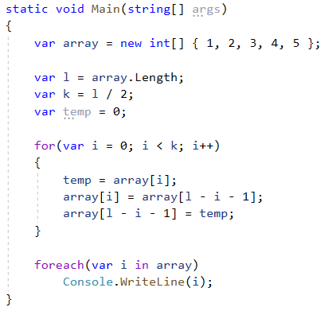
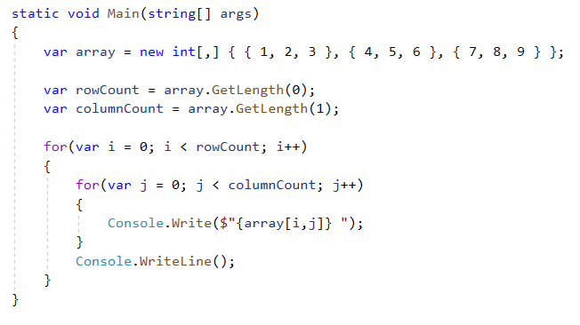
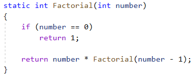
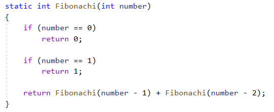

# **`Структура программы`**

## **Инструкции**
## **Метод Main**
## **Регистрозависимость**
## **Комментарии**

# **`Переменные`**

- Для хранения данных.
- Именованная область памяти, в которой хранится значение определенного типа.

# **`Литералы`**

- Неизменяемые значения.
- Значения переменных

Литералы бывают: логическими, целочисленными, вещественными, символьными и строчными. Отдельный литерал - null.

null - ссылка, которая указывает ни на какой объект. По сути - отсутствие значения

# **`Типы данных`**

- Определяет внутреннее представление данных

## **Использование системных типов**
## **Неявная типизация**

# **`Консольный ввод-вывод`**

## **Методы Parse и TryParse**

Все примитивы имеют два метода, которые позволяют преобразовать строку к определенному типу. Это Parse() и TryParse().

Parse() в качестве параметра принимает строку и возвращает объект определенного типа.

TryParse() пытается преобразовать строку к определенному типу и, если успешно, то возвращает true.

## **Convert** 

Статический класс, который содержит ряд статических методов, к примеру ToInt32(value).

В качестве параметра в методы можно передавать значение различных примитивных типов.

Также как и с методом Parse(), если методу не удастся сделать преобразование, то будет выброшено исключение. 

Parse (если null -> исключение)
Convert (если null -> то 0)

# **`Арифметические операции языка C#`**

Операции бывают: унарные, бинарные, тернарные.

- при делении, если 2 операнда, к примеру int, то результат округляется до целого числа (5 / 2 = 2).

# **`Преобразование базовых типов данных`**

- арифметические операции (+, -, /, *) - возвращают int, если операнды представляют целочисленный тип данных

## **Явные и неявные преобразования**

- неявные (implicit) - расширяющие преобразования (от меньшего к большему)
- явные (explicit) - сужающие преобразования (от большего к меньшему)

Замечание: При преобразовании double -> decimal, надо делать явное преобразование.

## **Потеря данных и ключевое слово checked**

При использовании ключевого слова checked, либо использование его как блок кода, приложение выбрасывает исключение (OverflowException) о переполнении.

# **`Условные конструкции`**

## **Конструкция if/else**

## **Конструкция switch**

- в конце каждого блока case должен быть один из операторов перехода: break, goto case, return, throw
- если совпадения нет, можно добавить блок default

# **`Циклы`**

- for - внутри МОЖНО делать манипуляции над данными
- foreach - внутри НЕЛЬЗЯ делать манипуляции над данными
- do..while
- while

## **Операторы continue и break**

- continue - пропускает итерацию
- break - выходит из цикла

# **`Массивы`**

- Набор однотипных данных.
- Для обращения к данным массива используются индексы.

## **Многомерные массивы**

- Характеризуются понятием ранг. (Если ранг - 2, то массив двухмерных).
- Ранг - кол-во измерений

## **Массив массивов**

- Массив, который содержит в себе другие массивы
- Длина указывается только в первых квадратных скобках

# **`Методы`**

- Именованный блок кода, который выполняет некоторые действия.

# **`Параметры методов`**

## **Необязательные параметры**

- Имеют значение по умолчанию.
- После таких параметров, последующие должны быть также необязательными

## **Именованные параметры**

- Используя такие параметры, можно нарушить порядок передаваемых данных.

# **`Передача параметров по ссылке и значению. Выходные параметры`**

## **Передача параметров по значению**

Метод получает не саму переменную, а ее копию.

## **Передача параметров по ссылке**

Метод получает адрес переменной в памяти.

Ref:
- переменная которая будет передаваться в метод, ТРЕБУЕТСЯ инициализация

Out:
- переменная которая будет передаваться в метод, НЕ ТРЕБУЕТСЯ инициализация
- в методе, параметру ОБЯЗАТЕЛЬНО присвоить значение

In:
- внутри метода, значение параметра изменять НЕЛЬЗЯ

## **Массив параметров и ключевое слово params**

- с помощью ключевого слова params, можно передавать неопределенное кол-во параметров
- параметр с ключевым словом params, должен представлять одномерный массив того типа, который собираемся использовать
- параметры помимо параметра с ключевым словом params, определяются до его определения. После него не можем указывать другие параметры

# **`Рекурсивные функции`**

- Это такая конструкций, при которой функция вызывает саму себя.

# **`Перечисления`**

- набор логически связанных констант
- константы представляют целочисленный тип (по умолчанию int)
- нумерация констант в перечислении начинается с 0 (можно указывать значения явно)
- перечисление представляет тип данных (можно определить переменную этого типа и использовать в программе)
- зачастую выступает в качестве хранилища состояния, в зависимости от которого производятся некоторые действия

# **`Кортежи`**

- способ работы с набором значений

Использование:
- передача в качестве параметра в метод
- могут быть возвращаемым результатом метода