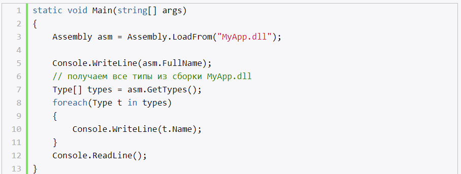
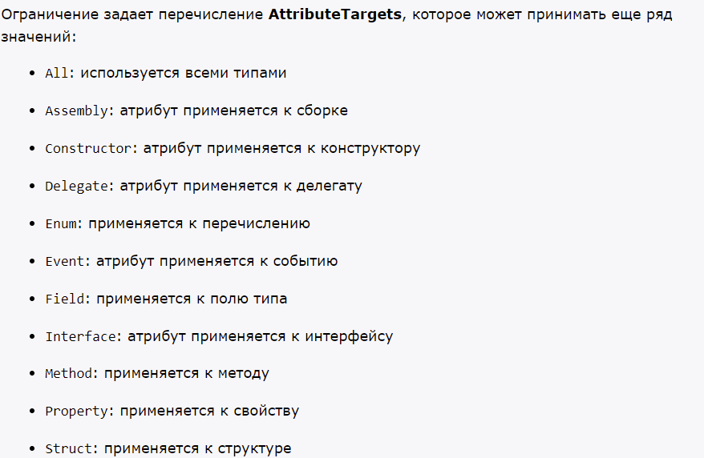

# **`Введение в рефлексию. Класс System.Type`**

- процесс выявления типов во время выполнения приложения
- функционал в System.Reflection
- для получения информации о членах типа, используется класс System.Type

## **Получение типа**

- typeof
- GetType - (метод класса Object)
- Type.GetType()

# **`Применение рефлексии и исследование типов`**

- GetMembers() - вся информация о типе

## **Получение информации о методах**

- GetMethods() 
- GetParameters() 

## **Получение конструкторов**

- GetConstructors()

## **Получение информации о полях и свойствах**

- GetFields()
- GetProperties()

## **Поиск реализованных интерфейсов**

- GetInterfaces

# **`Динамическая загрузка сборок и позднее связывание`**

Создавай проект, можно добавлять в него другие сборки, для эффективного их использования. При обращении к функционалу этих сборок, они автоматически подгружаются.

Но также можно подгружать сборки динамически, на которые в проекте нет 
ссылок.

Загружать dll, не exe.

Для этого в System.Reflection есть класс Assembly. Методы:
- Assebmly.LoadFrom("путь к сборке")

- Assebmly.Load("дружественное имя сборки") 

## **Позднее связывание**

- можно реализовать за счет динамической загрузки
- позволяет создавать экземпляры некоторого типа, а также использовать его во время выполнения приложения
- использование менее безопасно, чем раннее связывание

# **`Атрибуты в .NET`**

- инструмент, который встраивает в сборку дополнительные метаданные
- основа, класс System.Attribute, от которого образованые все остальные классы атрибутов
-  пока к классу с атрибутом не применена рефлексия, атрибут не размещается в памяти, и никакого влияния на данный класс не оказывает.

Применение:
- классу
- интерфейсу
- полям
- и т.д.

## **Ограничение применения атрибута**

С помощью атрибута AttributeUsage можно ограничить типы, к которым будет применяться атрибут

