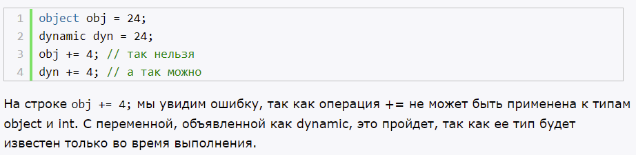
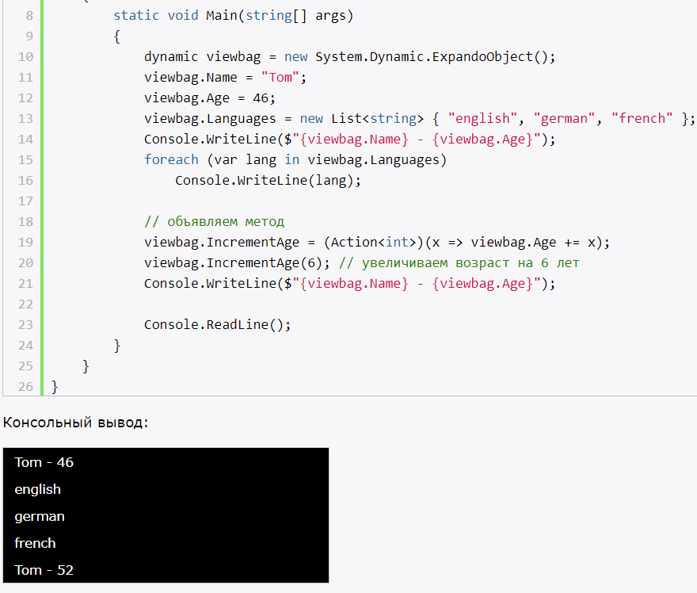

# **`DLR в C#. Ключевое слово dynamic`**

- появилось в .NET 4.0

Языки со статической типизацией, выявление типов происходит на этапе компиляции.

dynamic:
- тип определяется во время выполнения
- тип может меняться в ходе работы программы 

Таким образом dynamic отличается от var

Общее между object:
- также может менять тип в ходе работы программы

Отличие от object:
- dynamic может применяться к переменным, свойствам, методам

# **`Классы DynamicObject и ExpandoObject`**

- ExpandoObject - позволяет создавать динамические объекты, наподобие тех, что используются в javascript

- DynamicObject - позволяет задавать динамические объекты. Только в данном случае нам надо создать свой класс, унаследовав его от DynamicObject и реализовав его методы