# Параллельное программирование и библиотека TPL

Усовершенствует многопоточное программирвоание:
- упрощает создание и применение многих потоков
- автоматически использует несколько процессоров

- функционал в System.Threading.Tasks
- распараллеливает задачи и выполняет сразу на нескольких процессорах, если имеется несколько ядер на компьютере

## Задачи и класс Task

- отдельная задача, которая запускается асинхронно в одном из потоков из пула потоков (конрейнер ссылок на рабочие потоки)
- можно запустить синхронно в текущем потоке

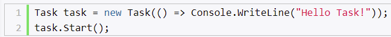

- Task принимает делегат Action
- Start запускает задачу

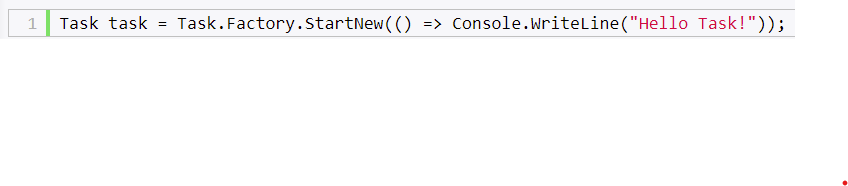

- принимает Action
- сразу же запускает задачу

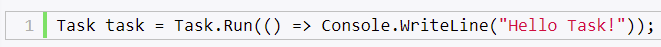

- статический метод Run
- принимает делегат
- возвращает объект Task

## Ожидание задачи

- Задачи не выполняются последовательно
- подождать конца выполнения задачи - метод Wait

# Работа с классом Task

- задача может запускать вложенную задачу (вып независимо друг от друга)

## Массив задач

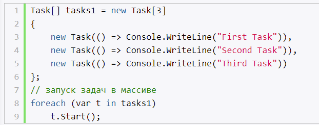

Если необходимо выполнять некоторый код лишь после того, как все задачи из массива завершатся, то применяется метод Task.WaitAll(tasks), WaitAny

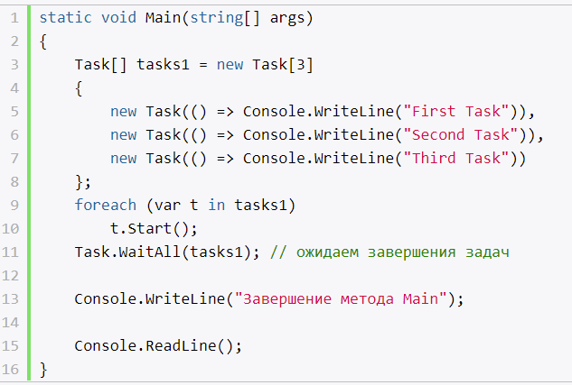

## Возвращение результатов из задач

- типизировать Task
- в качестве задачи, должен быть метод, возвращающий данный тип

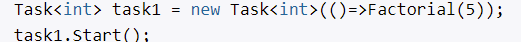

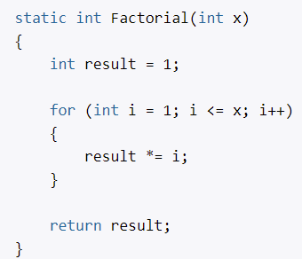

# Задачи продолжения

- задачи, которые выполняются после завершения других задач
- метод ContinueWith(Action)

# Класс Parallel

- для упрощения параллельного выполнения кода
- имеет ряд методов, которые позволяются распараллелить задачу
- в качестве параметра принимает массив объектов Action

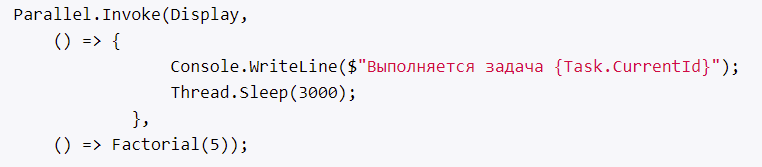

## Parallel.For

- Метод Parallel.For позволяет выполнять итерации цикла параллельно
- `For(int, int, Action<int>)`

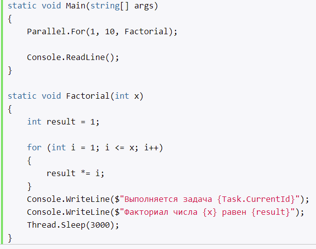

## Parallel.ForEach

- Метод Parallel.ForEach осуществляет итерацию по коллекции, реализующей интерфейс IEnumerable, подобно циклу foreach, только осуществляет параллельное выполнение перебора.

Он имеет следующее определение: `ParallelLoopResult ForEach<TSource>(IEnumerable<TSource> source,Action<TSource> body)`, где первый параметр представляет перебираемую коллекцию, а второй параметр - делегат, выполняющийся один раз за итерацию для каждого перебираемого элемента коллекции.

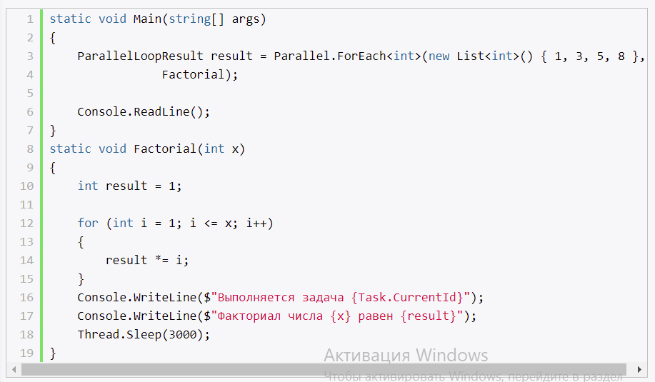

## Выход из цикла

- обхект ParallelLoopState.Break()

# Отмена задач и параллельных операций. CancellationToken

- чтобы прервать выполняемую задачу

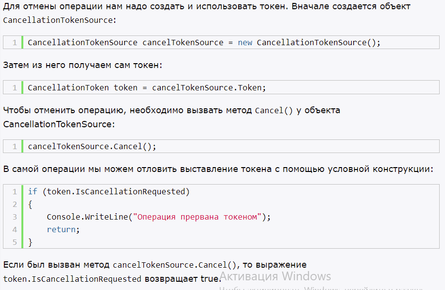