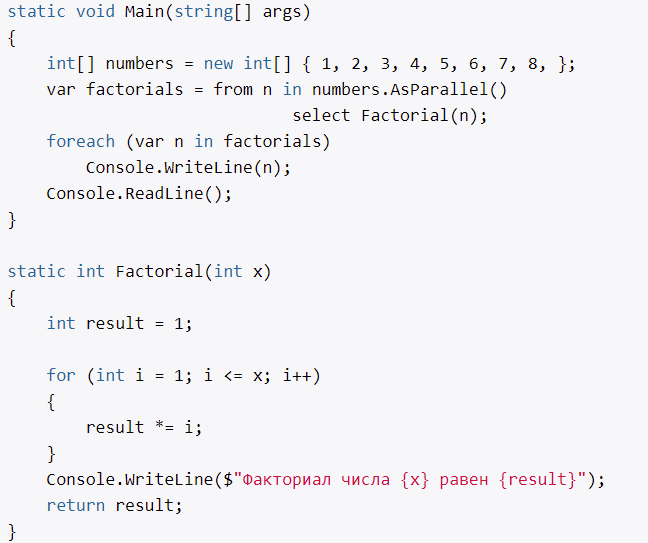

# Введение в Parallel LINQ. Метод AsParallel

- обращения к коллекции в параллельном режиме
- использует возможности всех процессоров в системе
- источник данных разделяется на сегменты, и каждый сегмент обрабатывается в отдельном потоке

Проблемы:
- при доступе к общему разделяемому состоянию в параллельных операциях будет неявно использоваться синхронизация, чтобы избежать взаимоблокировки доступа к этим общим ресурсам. Затраты на синхронизацию ведут к снижению производительности, поэтому желательно избегать или ограничивать применения в параллельных операциях разделяемых ресурсов.
- если параллельная обработка потенциально требует больших затрат ресурсов, то PLINK в этом случае может выбрать последовательную обработку, если она не требует больших затрат ресурсов

## Метод AsParallel

- распараллеливает запрос к данным
- метод расширения LINQ
- не выполняются последовательно

## Метод ForAll

Выше пример имеет недостатки:

его использование приводит к увеличению издержек - необходимо склеить полученные в разных потоках данные в один набор и затем их перебрать в цикле.

- выводит данные в том же потоке, в котором они обрабатываются
- в качестве параметра принимает Action

# Метод AsOrdered

- orderby и OrderBy() - упорядочивают результирующую выборку в соответствии с результатами
- упрорядочивает в соответствии с тем, как элементы располагаются в исходной последовательности

# Обработка ошибок и отмена операции

**При параллельной обработке коллекция разделяется а части, и каждая часть обрабатывается в отдельном потоке. Однако если возникнет ошибка в одном из потоков, то система прерывает выполнение всех потоков.**

При генерации исключений все они агрегируются в одном исключении типа `AggregateException`

## Прерывание параллельной операции

-  нам может потребоваться прекратить операцию до ее завершения. В этом случае мы можем использовать метод WithCancellation(), которому в качестве параметра передается токен CancellationToken
