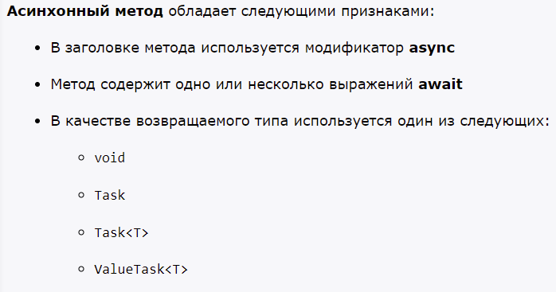
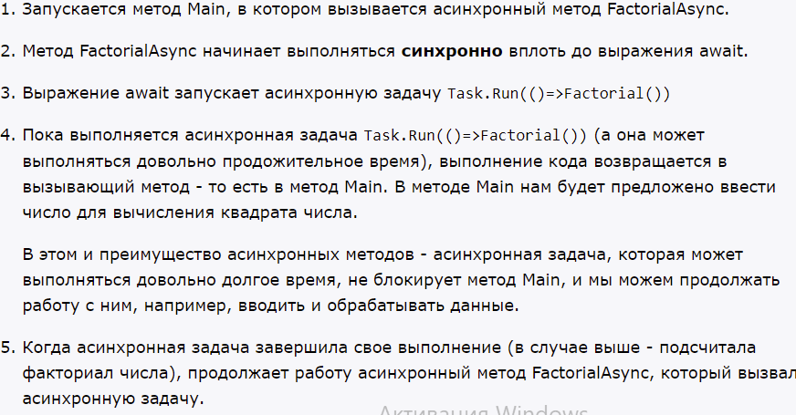
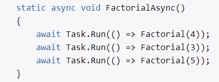

# Асинхронные методы, async и await

- Асинхронность позволяет вынести отдельные задачи из основного потока в специальные асинхронные методы или блоки кода

При больших запросах к базе данных асинхронный метод просто уснет на время, пока не получит данные от БД, а основной поток сможет продолжить свою работу. В синхронном же приложении, если бы код получения данных находился в основном потоке, этот поток просто бы блокировался на время получения данных.

- не может определять параметры (ref, out)
- async - не делает метод асинхнорнным. Указывает, что метод может содержать одно или несколько выражений await

## Передача параметров в асинхронную операцию
## Получение результата из асинхронной операции

# Возвращение результата из асинхронного метода

- void
- Task
- `Task<T>` - класс
- `ValueTask<T>` - структура

По умолчанию тип ValueTask недоступен, и чтобы использовать его, вначале надо установить через NuGet пакет System.Threading.Tasks.Extensions.

# Последовательный и параллельный вызов асинхронных операций

Асинхронный метод может содержать множество выражений await. Когда система встречает в блоке кода оператор await, то выполнение в асинхронном методе останавливается, пока не завершится асинхронная задача. После завершения задачи управление переходит к следующему оператору await и так далее. Это позволяет вызывать асинхронные задачи последовательно в определенном порядке. 

Однако не всегда существует подобная зависимость между задачами. В этом случае мы можем запустить все задачи параллельно и через метод `Task.WhenAll` отследить их завершение.

