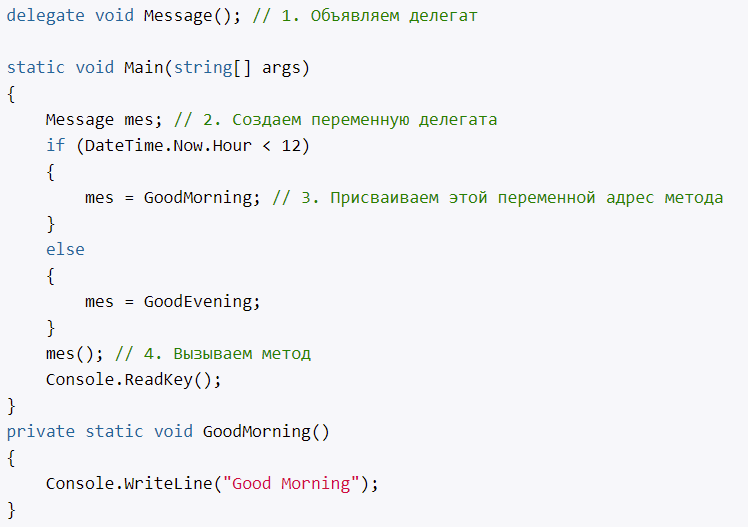
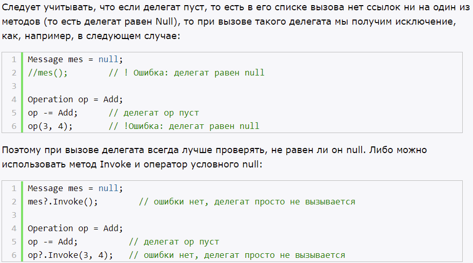
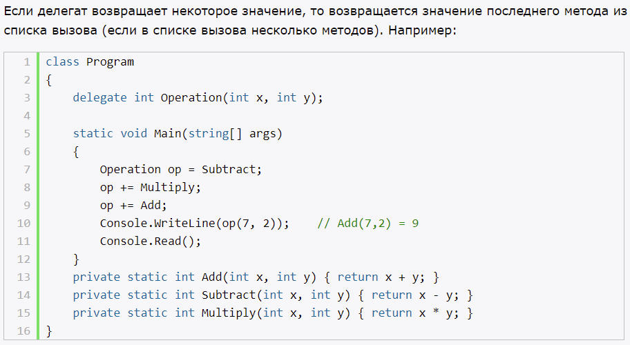

# **`Делегаты`**

- объекты, которые указывают на метод
- последовательность действий, которые будут выполнены в подходящее время
- экземпляры делегатов НЕИЗМЕНЯЕМЫ

## **Определение делегатов**

- тип делегата наследуется от (abstract) MulticastDelegate, который в свою очередь, происходит от (abstract) Delegate
- могут указывать на методы из других классов, структур

Два способка указать делегату на метод (оба равноценны):
- напрямую (`Delegate del = Method;`)
- через конструктор (`Delegate del = new Delegate(Method);`)

## **Добавление методов в делегат**

- += (добавление в конец), -= (удаление с конца)
- делегат может указывать на несколько методов (такие методы находятся в invocation list)
- может указывать несколько раз на один и тот же метод
- при вызове делегата, все методы последовательно вызываются

В реальности, когда в делегат добавляем новый метод, будет происходить создание нового объекта делегата, который получит методы старой копии делегата и новый метод

## **Объединение делегатов**

- делегаты можно объединять в другие делегаты

## **Вызов делегата**

- как обычный метод
- через метод Invoke() - синхронный вызов. (BeginInvoke(), EndInvoke() - асинхронный)

## **Делегаты как параметры методов**
## **Обобщенные делегаты**

# **`Применение делегатов`**

Пример из книги, Джон Скит. Программирование для профессионалов (2-е издание). Когда вы пишете завещание, набор действий, который обязан выполнить переемник.

- позволяют делегировать выполнение некоторому коду извне

# **`Анонимные методы`**

- для создания экземпляров делегата

Применимы:
- когда надо определить однократное действие, которые не имеет много инструкций и нигде больше не используется.

# **`Лямбды`** 

- упрощенная запись анонимных методов
- слева список параметров, справа - блок выражений

# **`События`** 

- подобие свойств
- определенный тип, который рассматривается как тип делегата
- не является экземплярами делегата, это только пары методов add/remove (как и свойства)

- add - вызывается при добавлении обработчика
- remove - вызывается при удалении обработчика

Причина существования событий:
- как и свойства, это дополнительный слой инкапсуляции, реализующий шаблон (публикация/подписка)

# **`Ковариантность и контравариантность делегатов`**

## **Ковариантность - для возвращаемого типа делегата**

Позволяет вернуть из метода объект, тип которого более производный по сравнению с типом, который возвращает делегат.

## **Контравариантность - для параметров делегата**

Позволяет передать в метод объект, тип которого является базовым по сравнению с типом параметра делегата

## **Инвариантность**

Позволяет использовать только заданный тип

# **`Делегаты Action, Predicate и Func`**

- action - void, принимает параметры
- predicate - bool, один параметр (для сравнения)
- func - TResult, принимает параметры