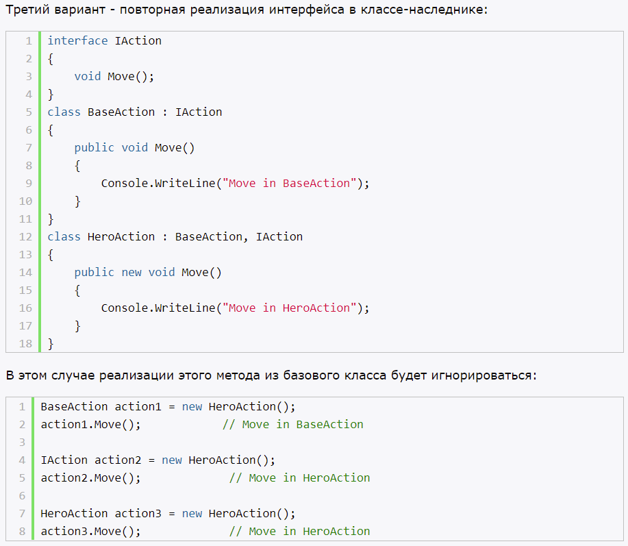
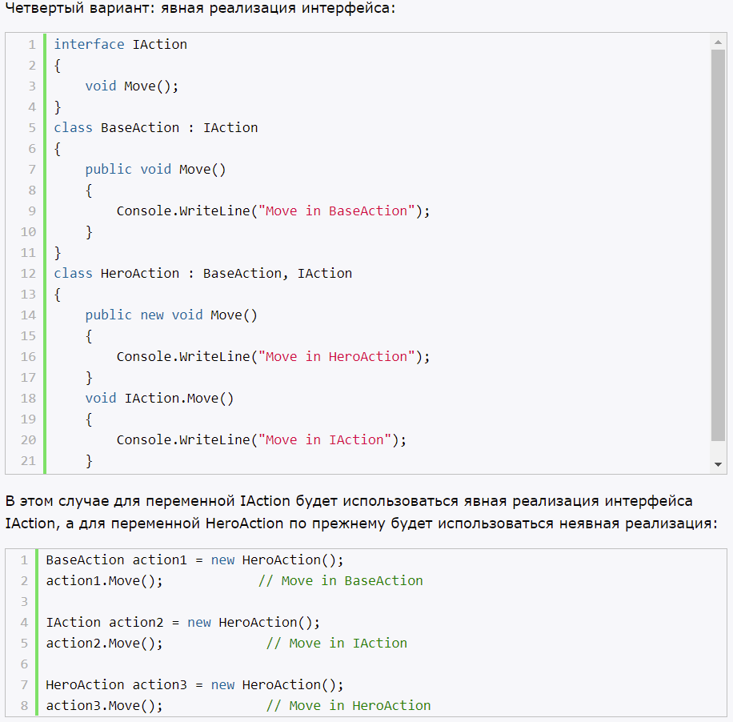
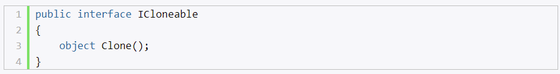
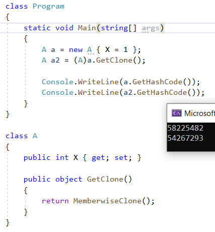
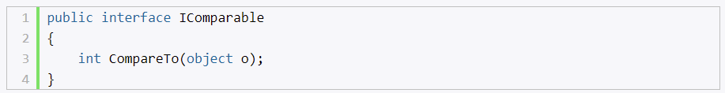
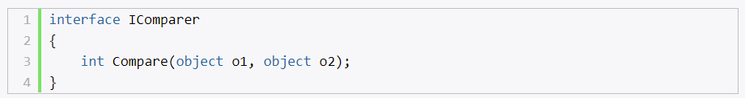

# **`Определение интерфейсов`**

- ccылочный тип, который определяет фукнционал для будущей реализации кем-то
- нельзя создать экземпляр интерфейса
- множественная реализация интерфейсов

Члены интерфейса:
- методы
- свойства
- индексаторы
- события
- статические поля, константы (C# 8.0)

С# 8.0
- статические поля, константы
- модификаторы доступа для членоd интерфейса (по умолчанию все public)
- реализация по умолчанию (свойства и методы)

# **`Явная реализация интерфейсов`**

- IAction.Move() - явная реализация (интерфейс + член интерфейса)

Если класс производит явную реализацию (например, метода), то этот метод не является частью класса. При вызове такого метода, надо сделать приведение к типу интерфейса.

Применение явной реализации:
- когда два интерфейса имеют одинаковые методы
- в базовом классе интерфейс реализован, но необходимо в производном по-своему реализовать интерфейс
- если модификатор доступа не public

# **`Реализация интерфейсов в базовых и производных классах`**

1) Первый вариант - переопределение виртуальных/абстрактных методов
2) Второй вариант - сокрытие метода в производном классе

# **`Наследование интерфейсов`**

- интерфейсы могут наследоваться
- к интефрейсам нельзя применять модификатор sealed, abstract
- модификаторы при наследовании, такие же как и у классов

# **`Интерфейсы в обобщениях`**

- могут быть обобщенными
- могут выступать в качестве ограничений обобщений
- то в качестве ограничения, класс можно указывать один, то интерфейсов может быть много

# **`Копирование объектов. Интерфейс ICloneable`**

Также можно использовать метод MemberwiseClone() - поверхностное копирование.

# **`Сортировка объектов`**

- Array.Sort(массив) - работает только на набором примитивных типов 

## **Интерфейс IComparable**

Метод CompareTo предназначен для сравнения текущего объекта с объектом, который передается в качестве параметра object o. На выходе целое число.

## **Интерфейс IComparer**

Метод Compare предназначен для сравнения двух объектов o1 и o2. На выходе целое число.

Объект компаратора указывается в качестве второго параметра метода Array.Sort(). При этом не важно, реализует ли класс интерфейс IComparable или нет. Правила сортировки, установленные IComparer, будут иметь больший приоритет.