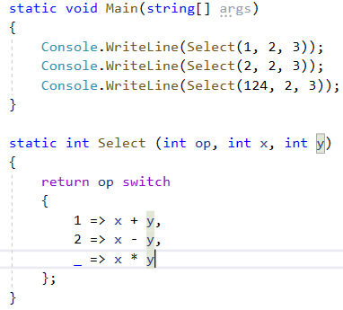

# **`Методы расширения`**

- Позволяют добавлять новые методы в уже существующие типы
- Реализуются в static классе
- Метод расширения static метод

# **`Частичные класса и методы `**

- класс определен в нескольких файлах (на этапе компиляции они будут скомпилированы в одно)

## **Частичные методы**

- определение (без тела) метода в одном классе, реализация - в другом

# **`Анонимные типы`**

- CLR понимает как ccылочный тип
- для создания объекта с некоторым набором свойств без определения класса
- объявляется через var
- свойства анонимного типа только для чтения

Применение:
- для временного хранения выборки из БД

# **`Локальные функции`**

- функции, определенные внутри других методах
- задает свою область видимости
- доступны все переменные, которые определены в том же методе

C# 8.0:
- статическая локальная функция (не может обращаться к переменным, которые определены в том же методе)

# **`Деконструкторы`**

- декомпозируют объект на отдельные части
- как минимум два выходных параметра 

 

# **`Паттерны switch`**

## **Возвращение значения из switch**

C# 8.0 позволяет сократить конструкцию switch:
- не требуется оператор case
- вместе default (_)
- сразу возвращает значение

# **`Nullable-типы`**

По умолчанию, только ссылочные типы могут принимать значение null. Чтобы примитивные типы также могли использовать значение null, можно использовать `Nullable<T>` или `?`.

Для всех типов Nullable есть два свойства: Value, HasValue.

## **Равенство объектов**

Равны не только, когда они имеют ненулевые значения, которые совпадают, но и когда оба объекта равны null
