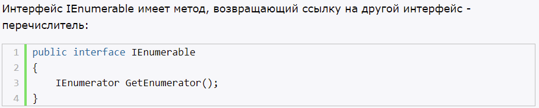
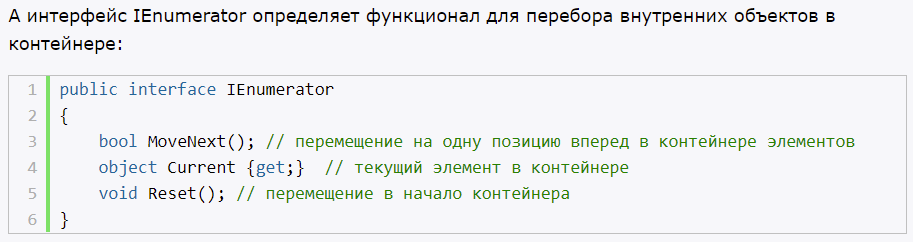
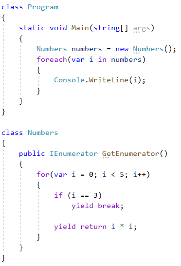

# **`Массивы`**

- хранят наборы однотипных объектов.
- хранит фиксированное кол-во объектов

Плюсы коллекций:
- динамическая размерность
- некоторые коллекции реализуют стандартные структуры данных (стек, очередь, словарь)

Пространства имен:
- System.Collections (ArrayList)
- System.Collections.Generic (List, LinkedList, Queue)
- System.Collections.Specialized
- System.Collections.ObjectModel (ObservableCollection)
- System.Collections.Concurrent - про параллелизма и многопоточности

# **`ArrayList`**

- хранит разнотипные объекты (числа, строки, объекты)

# **`List<T>`**

- хранит однотипные объектов
- для получения элементов колекции применяется индекс (под капотом индексатор)

# **`Двухсвязный список LinkedList<T>`**

- двухсвязный список однотипных объектов
- каждый элемент хранит ссылку на следующий и на предыдущий элемент
- каждый элемент представляет объект класса `LinkedListNode<T>`

# **`Очередь Queue<T>`**

- алгоритм FIFO
- Dequeue, Enqueue, Peek (из начала, без удаления)

# **`Коллекция Stack<T>`**

- алгоритм FILO
- Pop, Push, Peek (из начала, без удаления)

# **`Коллекция Dictionary<T, V>`**

- хранит объекты, которые представляют пару ключ-значение
- каждый такой объект является объектом структуры `KeyValuePair<TKey, TValue>` (структура readonly)
- метод Add(key, value)
- метод Remove() - удаляет по ключу

# **`Класс ObservableCollection`**

- по функциональности похож на List, только позволяет известить внешние объекты о том, что коллекция была изменена (с помощью события CollectionChanged)

# **`Интерфейсы IEnumerable и IEnumerator`**

- с их помощью мы можем перебирать коллекции в цикле foreach

# **`Итераторы и оператор yield`**

- итератор - блок кода, использует оператор yield (и только его)
- yield - для перебора набора значений

Итератор использует две инструкции:
- yield return - возвращает значение
- yield break - прерывает выполнение итератора

Использование оператора yield, ограничения:
- yield return нельзя использовать в try, если у него есть какой-нибудь блок catch
- yield return, break нельзя использовать в блоке finally