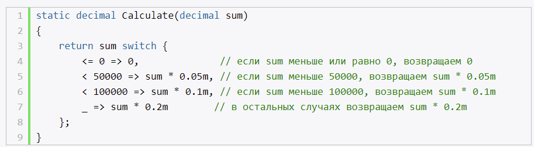
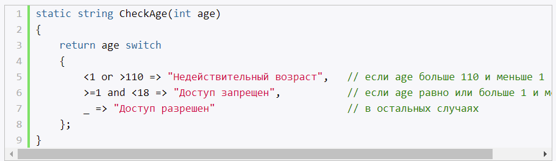
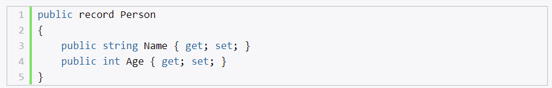
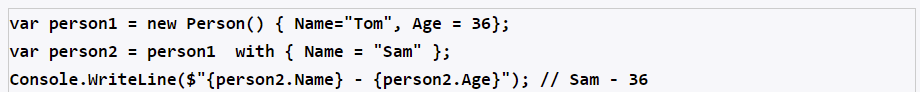
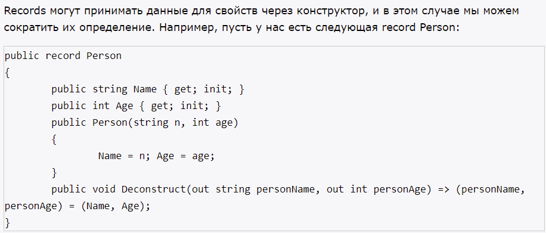
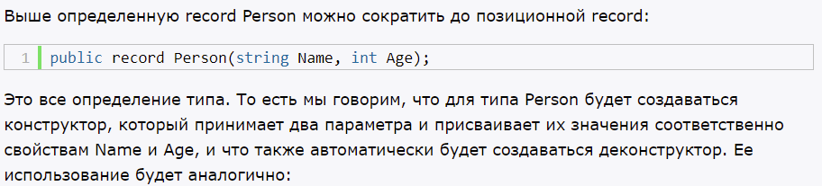

# **`Программы верхнего уровня`**

Если программа состот из одного метода Main(). То можно убрать из определения программы (namespace, класс Program, метод Main()). Оставить только директивы using.

- убирает шаблонный код
- для создания простого приложения

# **`Реляционный и логический паттерны`**

Реляционный паттерн позволяет сравнить передаваемое в конструкцию значение с некоторыми значениями с помощью операций сравнения.

Логический паттерн позволяет использовать логические операторы and (логическое умножение или операция логического И) и or (логическое сложение или операция логического ИЛИ) для объединения операций сравнения.

# **`Свойства с модификатором init`**

- вместо set
- значение устанавливается (конструктор / инициализатор)
- после установки значение, изменить его нельзя 

# **`Records`**

- ссылочный тип
- неизменяемый тип (условие: надо использовать модификатор init, вместо set) (отличие от класса)
- метод Equals() сравнивает объекты на основе значений (отличие от класса)

## **Оператор with**

Инициализация с помощью оператора with (создает один record на основе другого)

## **Позиционные records**

