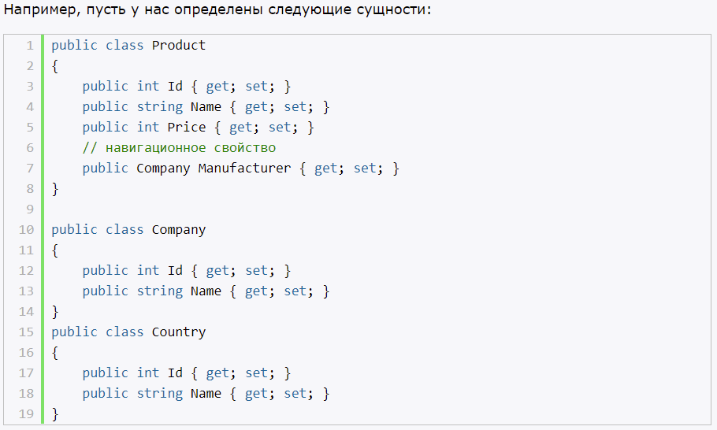
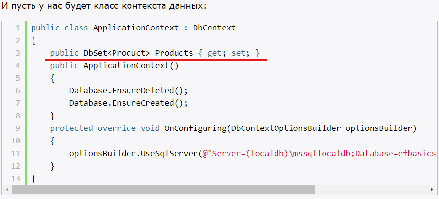
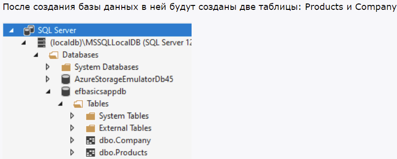
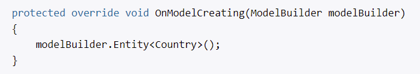
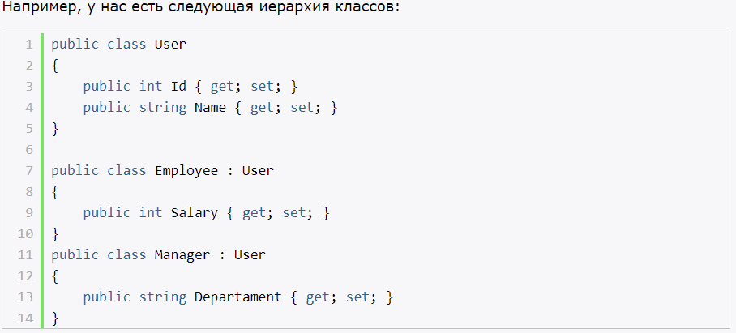
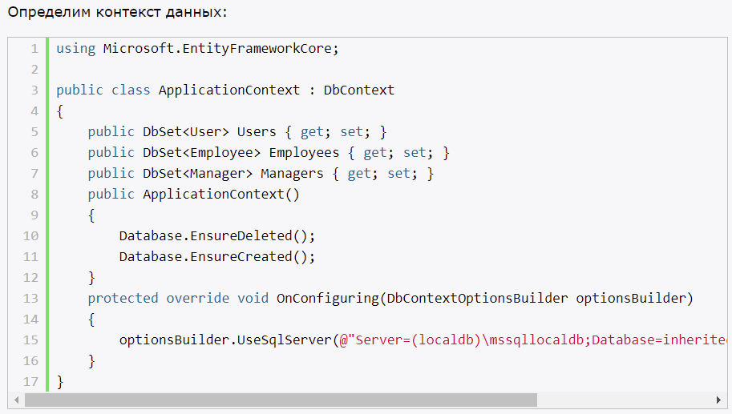
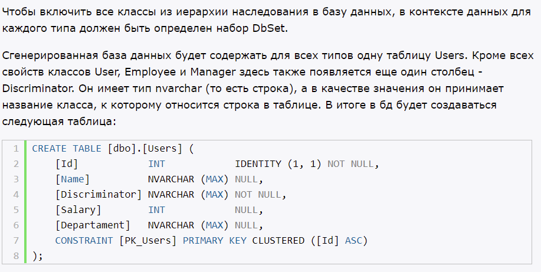
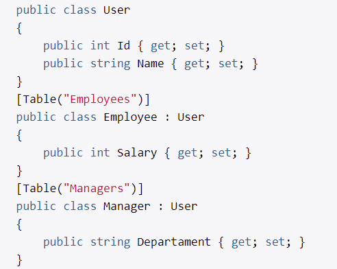
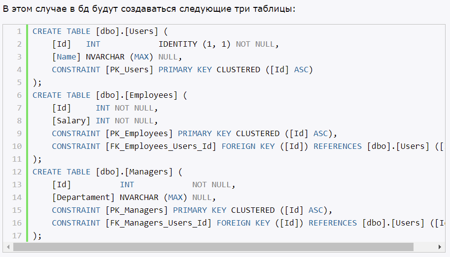
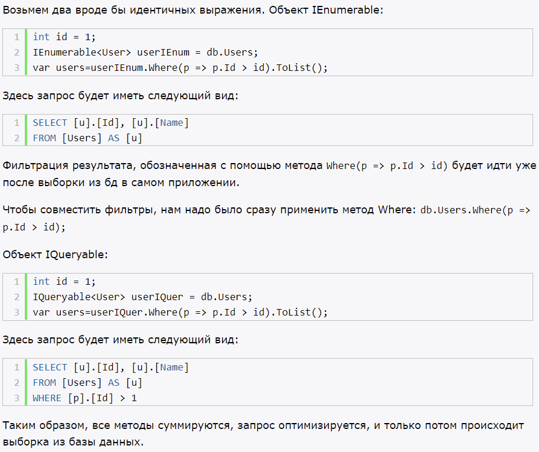

# `Введение в Entity Framework Core`

EF Core - объектно-ориентированная технология от Microsoft для доступа к данным. Является ORM-инструментом (object-relation mapping - отображения данных на реальные объекты). EF Core позволяет абстрагироваться от самой БД и работать с данными независимо от типа хранилища. Если на физическом уровне мы оперируем, таблицами, ключами, то в коде мы работаем с объектами.

EF Core поддерживает множество БД. Для каждой БД свой провайдер.

EF Core предоставляет универсальный API для работы с данными. Если сменить СУБД, то в коде изменить прежде всего конфигурации и настройки подключения, код - остается прежним.

EF Core может использоваться на различных платформах .NET (Console, WPF, ASP.NET...)

EF Core, как ORM, использует LINQ для выборки данных из БД.

--------------------------------

Entity Framework Core обеспечивает простое и удобное управление объектами из базы данных. При том в данном случае нам не надо даже создавать базу данных и определять в ней таблицы. Entity Framework все сделает за нас на основе определения класса контекста данных и классов моделей. И если база данных уже имеется, то EF не будет повторно создавать ее.

--------------------------------

Для подключения к существующей БД.

Scaffold-DbContext передается строка подключения с указанием сервера и названием базы данных

--------------------------------

Для взаимодействия с базой данных для контекста данных должна быть определена конфигурация подключения. Для ее установки можно применять три способа:
- Переопределение у класса контекста данных метода OnConfiguring()
- Передача конфигурации в конструктор базового класса DbContext

Оба выше представленных способа вполне работают, однако в том определении, в котором они представлены, они имеют один недостаток - строка подключения жестко определена в коде C#.

- Файл конфигурации

--------------------------------

EF Core поддерживает логгирование, причем мы можем воспользоваться как встроенными возможностями, так и создать и встроить свою инфраструктуру логгирования.

# Создание моделей в Entity Framework Core

Entity Framework сопоставляет столбцы таблицы и свойства класса.

Есть два механизма, с помощью которых можно добавить дополнительные правила конфигурации, либо переопределить используемые условности:
- Условно

Мы всегда должны начинать с настройки по соглашению. Итак, наличие того же имени класса, что и имя таблицы, наличие имени для свойства первичного ключа, которое соответствует соглашению об именовании, и наличие свойств с тем же именем и типом, что и столбцы, должны быть нашим первым выбором. Такой тип конфигурации довольно легко подготовить, и это также позволяет сэкономить время.

- Fluent API - настройка классов с помощью набора методов. И весь этот функционал задействуется при переопределении метода OnModelCreating

Скажем так, мы должны использовать этот подход для всего остального. Конечно, мы должны использовать этот подход для конфигурации, которую мы не можем сделать иначе, или когда мы хотим скрыть настройку конфигурации от класса модели. Итак, индексы, составные ключи, отношения - это то, что мы должны сохранить в OnModelCreatingметоде.

- Аннотации - настройка классов с помощью атрибутов

Для конфигурации проверки, такой как проверка обязательной или максимальной длины, вам всегда следует отдавать предпочтение аннотациям к данным, а не подходу Fluent API

--------------------------------

Миграция по сути предствляет план перехода базы данных от старой схемы к новой.

add-migration *name*, update-database

--------------------------------

## **`Определение модели`**

Через Fluent API 

Исключение из модели:
- [NotMapped]
- Ignore()

## **`Настройка ключей`**

- [Key]
- HasKey()
- HasAlternateKey() - на уровне БД как UNIQUE

## **`Настройка индексов`**

Можно настроить вручную с помощью Аннотаций и Fluent API.

## **`Генерация значений свойств и столбцов`**

По умолчанию для свойств первичных ключей, которые представляют типы int или GUID и которые имеют значение по умолчанию, генерируется значение при вставке в базу данных. Для всех остальных свойств значения по умолчанию не генерируется.

Можно настроить вручную с помощью Аннотаций и Fluent API.

--------------------------------

С помощью Fluent API мы можем задать многочисленные настройки для моделей и их свойств. Однако, если настроек очень много, то они могут утяжелять класс контекста. Однако в Entity Framework Core мы можем вынести конфигурацию моделей в отдельные классы.

Для вынесения конфигурации во вне необходимо создать класс конфигурации, реализующий интерфейс `EntityTypeConfiguration<T>.`

Вся конфигурация определена в методе OnModelCreating().

В качестве альтернативы мы могли бы использовать еще один вариант. Вместо выделения отдельных классов конфигураций определить конфигурацию в виде отдельных методов в том же классе контекста данных.

--------------------------------

Иногда необходимо, чтобы при первом запуске база данных уже содержала некоторые данные.

При этом следует учитывать, что инициализация начальными данными будет выполняться только в двух случаях:
- При выполнении миграции. (При создании миграции добавляемые данные автоматически включаются в скрипт миграции)
- При вызове метода Database.EnsureCreated(), который создает БД при ее отсутствии

# **`Отношения между моделями`**

Есть три стратегии загрузки связанных данных:
- жадная загрузка

Загружает данные методом Include(). На уровне БД это будет конструкция LEFT JOIN.

ThenInclude() - позволяет спуститься на уровень ниже по иерархии.

- явная загрузка

Загружает данные с помощью метода Load(). На уровне БД это будет конструкция WHERE.

Для загрузки данных можно использовать Collection() - если навигационное свойства коллекция. Reference() - если навигационное свойство одиночный объект.

- ленивая загрузка

Неявная автоматическая загрузка связанных данных при обращении к навигационному свойству.

Условия:
1) В конфигурации контекста данных вызвать метод UseLazyLoadingProxies()
2) Все навигационные свойства должны быть определены как виртуальные, при этом сами классы моделей должны быть открыты для наследования

Однако при использовании lazy loading следует учитывать что если в базе данных произошли какие-нибудь изменения, например, другой пользователь изменил данные, то данные не перезагужаются, контекст продолжает использовать те данные, которые были ранее загружены, как собственно было показано выше.

# **`Наследование`**

## **`TPH (Таблица на одну иерархию классов)`**

EF Core использует это наследование по умолчанию

При использовании данного подхода TPH для всех классов из одной иерархии в базе данных создается одна таблица. А чтобы определить, к какому именно классу относится строка в таблице, в этой же таблице создается дополнительный столбец - дискриминатор.

## **`TPT `**

Он позволяет выделить для каждого класса из одной иерархии классов в базе данных отдельную таблицу. Для его реализации мы можем использовать два способа: через атрибуты или через Fluent API.

# **`Запросы и LINQ to Entities`**

Для взаимодействия с источником данных Entity Framework Core использует технологию LINQ to Entities.

Entity Framework Core, используя выражения LINQ to Entities, транслирует их в определенные запросы, понятные для используемого СУБД.

--------------------------------

Запросы могут быть отслеживаемыми и неотслеживаемыми. По умолчанию все запросы, которые возвращают объекты классов моделей являются отслеживаемыми. Когда контекст данных извлекает данные из базы данных, Entity Framework помещает извлеченные объекты в кэш и отслеживает изменения, которые происходят с этими объектами вплоть до использования метода SaveChanges()/SaveChangesAsync(), который фиксирует все изменения в базе данных. Но нам не всегда необходимо отслеживать изменения. Например, нам надо просто вывести данные для просмотра.

Чтобы данные не помещались в кэш, применяется метод AsNoTracking(). Этот метод применяется к набору IQueryable. При его применении возвращаемые из запроса данные не кэшируются. То есть запрос является неотслеживаемым. А это означает, что Entity Framework не производит какую-то дополнительную обработку и не выделяет дополнительное место для хранения извлеченных из БД объектов. И поэтому такие запросы работают быстрее.

--------------------------------

Как EF Core обрабатывает запросы на получение данных из БД:
1) Вначале выражения LINQ обрабатываются Entity Framework Core, и на их основе создается объект запроса в той форме, в которой он может обрабатываться провайдером базы данных.
2) Созданный объект запроса кэшируется, что позволяет не пересоздавать его при повторном его выполнении.
3) Затем этот объект запроса передается провайдеру базы данных, который транслирует его на язык, понятный для базы данных (например, SQL). База данных обрабатывает запрос и возвращает определенный результат.
4) EF Core получает результат обработки, и дальше его действия зависят от того, отслеживаются ли результаты запроса или нет.

Если запрос является отслеживаемым, то десь есть два альтернативных варианта:
- Если данные, полученные из бд, представляют объекты, которые уже отслеживаются, то есть они уже есть в контексте, то EF возвращает те объекты, которые уже есть в контексте.
- Если данные, полученные из бд, представляют объекты, которые еще не отслеживатся, их нет в контексте, то EF создает по этим данным новые объекты, добавляет в контекст, начинает их отслеживать и возвращает их пользователю.

Если запрос является не отслеживаемым, то есть отслеживание отключено с помощью метода AsNoTracking(), то EF создает по этим данным новые объекты и возвращает их пользователю. В отличие от отслеживаемых запросов созданные объекты не добавляются в контекст и не отслеживаются.

--------------------------------

В процессе выполнения запросов LINQ to Entities мы может получать два объекта, которые предоставляют наборы данных: IEnumerable и IQueryable.

C одной стороны, интерфейс IQueryable наследуется от IEnumerable, поэтому по идее объект IQueryable это и есть также объект IEnumerable. Но реальность несколько сложнее. Между объектами этих интерфейсов есть разница в плане функциональности, поэтому они не взаимозаменяемы.

Интерфейс IEnumerable находится в пространстве имен System.Collections и System.Collections.Generic.
- Объект IEnumerable представляет набор данных в памяти и может перемещаться по этим данным только вперед.
- Запрос, представленный объектом IEnumerable, выполняется немедленно и полностью. 
- При выполнении запроса IEnumerable загружает все данные, и если нам надо выполнить их фильтрацию, то сама фильтрация происходит на стороне клиента.

Интерфейс IQueryable располагается в пространстве имен System.Linq. 
- Объект IQueryable предоставляет удаленный доступ к базе данных и позволяет перемещаться по данным как в прямом порядке от начала до конца, так и в обратном порядке.
- В процессе создания запроса, возвращаемым объектом которого является IQueryable, происходит оптимизация запроса. В итоге в процессе его выполнения тратится меньше памяти, меньше пропускной способности сети, но в то же время он может обрабатываться чуть медленнее, чем запрос, возвращающий объект IEnumerable.

Что же лучше использовать? Все зависит от конкретной ситуации. Если разработчику нужен весь набор возвращаемых данных, то лучше использовать IEnumerable, предоставляющий максимальную скорость. Если же нам не нужен весь набор, а то только некоторые отфильтрованные данные, то лучше применять IQueryable.

# **`SQL в Entity Framework Core`**

LINQ to Entities позволяет создавать запросы к источнику данных. Однако в случае, если запрос очень сложный по своей структуре или нам его легче описать на языке SQL, то в Entity Framework Core выполнить напрямую sql-запрос.
