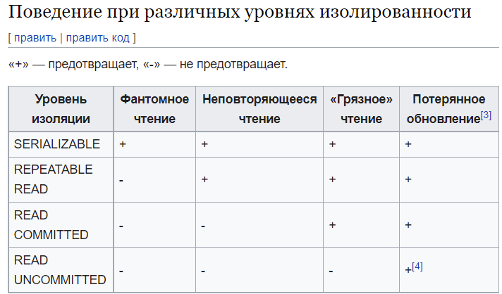

# **`Руководство по MS SQL Server`**

База данных — организованный набор данных.
База данных — совокупность взаимосвязанных данных.

Система управления базами данных — программа для хранения и обработки данных в БД.

## **Нормализация**

Нормализация — процесс преобразования таблиц БД к нормальной форме.
Шесть нормальных форм. Практическое применение имеют первые три формы.

Транзитивная зависимость — зависимость между неключевыми полями. (неключевое поле не зависит от не ключевого поля)

Первая форма: 
- строки различные
- значения атомарные (не списками)

Вторая форма:
- 1nf
- неключевые поля зависят от первичного ключа

Третья форма:
- 2nf
- отсутствие транзитивной зависимости 

## **SQL**

SQL – язык, для написания запросов к БД.

Группа операторов SQL:
- DDL (Data definition language) – для работы с объектами бд
	1) create, alter, drop
- DML (Data manipulation language) – для работы с данными в таблице
	2) insert, update, delete, select
- TCL (Transaction control language) – для работы с транзакциями
	3) begin tran, save tran, commit tran, rollback tran
- DCL (Data control language) – для работы с правами доступа
	4) gran, revoke, deny

# **`Глава 2. Начало работы с MS SQL Server`**

В MS SQL Server есть два типа баз данных:
- Системные – необходимы серверу для корректной работы
- Пользовательские

Системные:
- master – хранит логины, роли, конфигурационные настройки и др
- msdb – хранит бэкапы
- model – представляет шаблон на основе которого создаются другие бд
- tempdb – хранилище для временных объектов. Пересоздается при каждом запуске сервера

## **Ограничения целостности**

Ограничения целостности — правила, на основе которых добавляются корректные данные в бд.

Виды ограничений целостности:
- primary key – первичный ключ, уникально иденцифицирует строку. Не допускает значение null
- foreign key – внешний ключ, необходим для установки связи между таблицами
- unique – столбец хранит только уникальное значение. Допускает значение null
- check – устанавливает значение согласно определенному условию
- default – устанавливает значение по умолчанию для столбца, в случае не установки значения явно
- null – не допускает значение null в столбце
- data type – не допускает, чтобы столбец имел значение не соответствующего типа.

Primary key и unique вместе ставить у столбца нельзя

# **`Глава 5. Группировка`**

## **Агрегатные функции**
- выполняют вычисления над значениями в наборе строк
- avg, sum, max, min, count
- avg, sum - для числовых
- max, min, count - для числовых, строк, дат
- можно комбинировать

## **GROUP BY и HAVING**

- GROUP BY - как строки будут группироваться
    1. если столбец в SELECT, то и в GROUP BY
    2. выборка по одному или +1 столбцам и агрегатная операция, то использовать GROUP BY
    3. значение NULL - отдельная группа

- HAVING - фильтрация групп
- WHERE - фильтрация строок

## **Расширения SQL Server для группировки**

- ROLLUP - добавляет суммирующую строку в результирующий набор
- CUBE - похож на ROLLUP, только добавляет суммирующую строку для каждой комбинации групп

# **`Глава 6. Подзапросы`**

## **Выполнение подзапросов**

- запросы в запросах

Виды подзапросов:
- коррелирующие
    1. подзапросы зависят от строк, которые выбираются в основном запросе
    2. выполняются для каждой отдельной строки выборки

- некоррелирующие
    1. подзапрос не зависит от строк, которые выбираются в основном запросе
    2. выполняет один раз для всего внешнего запроса

## **Подзапросы в SELECT**

Способы использования подзапросов:
- WHERE
- HAVING
- Использовать в качестве таблицы для выборки в выражении FROM
- Использовать в качестве спецификации столбца в выражении SELECT

- подзапрос возвращает как одно скалярное значение, так и набор значений
- ALL - условие верно для всех значений
- SOME/ANY - для хотя бы одного

## **Оператор EXISTS**

- проверяет, возвращает ли подзапрос какое-либо значение

# **`Глава 7. Соединение таблиц`**

## **Неявное соединение таблиц**

- через WHERE

## **INNER JOIN**

- явное соединение 

## **ОUTER JOIN**

- внешнее соединенние
- LEFT - выборка содержит все строки из левой таблицы
- RIGHT
- FULL - выборка содержит все строки из обоих таблиц
- CROSS - перекрестное соединение

## **UNION**

- объединяет два однотипных набора в один
- UNION ALL - не удаляет повторяющие строки

## **EXCEPT**

Разность двух выборок

## **INTERSECT**

Пересечение двух выборок

# **`Глава 8. Встроенные функции`**

## **Преобразование**

- CAST - приводит один тип к другому
- CONVERT - тоже самое, что и CAST, только добавляет стиль форматирования

# **`Глава 9. Переменные и управляющие конструкции`**

## **Переменные в T-SQL**

- Для определения переменных - выражение DECLARE
- Для присвоения значения - выражение SET
- Выражение PRINT - выводит сообщение
- Выражение SELECT - выводит результат в виде таблицы

## **Переменные в запросах**

- переменные можно передавать в запросы
- в переменные мы можем помещать результаты запросов

## **Условные выражения**

- выражение IF ... ELSE
- выражение ELSE - необязательно
- если в конструкциях IF ... ELSE две и более инструкций, то они заключаеются в BEGIN ... END

## **Циклы**

- цикл WHILE - выполняет действия, пока условие истинно
- две и более инструкций, то они заключаеются в BEGIN ... END
- оператор BREAK - завершает цикл
- оператор CONTINUE - переходит к новой итерации

## **Обработка ошибок**

- конструкция BEGIN TRY ... END TRY, BEGIN CATCH ... END CATCH

# **`Глава 10. Представления и табличные объекты`**

## **Представления**

- Поименованный SELECT-запрос

Преимущества:
- упрощают комплексные SQL операции (т.е. можно сделать выборку из двух таблиц)
- защищают данные (т.е. дают доступ к части таблицы)

На что обратить внимание:
- имеют уникальные имена
- можно создавать на основе других VIEW
- SELECT во VIEW, не может иметь INTO/ORDER (но если есть TOP или OFFSET - можно). Если нужна сортировка, то применить с SELECT, который извлекает данные из представления

## **Обновляемое представление**

- Представления могут быть обновляемыми (добавлять, удалять или изменять строки)
- При изменении данных VIEW, изменяется таблица, на основе которой создано VIEW

Ограничения таких представлений (нельзя использовать):
- TOP, DISTINCT, UNIONT, JOIN,
- агрегатные функции
- GROUP BY/HAVING
- подзапросы
- обращение к нескольким таблицам

Чтобы операция вставки не могла осуществиться в том случае, когда информация не удовлетворяет условию (where), то следует создавать представление с опцией WITH CHECK OPTION.

## **Табличные переменные**

- объявляются через DECLARE
- живут в пределах одного пакета

## **Временные и производные таблицы**

Временные:
- для хранения временной информации
- живут на протяжении сессии
- хранится в tempdb
- если со знака # - локальная таблица (живет в течении текущей сессии)
- если со знака ## - глобальная таблица (доступна всем открытым сессиям)

Производные:
- более эффективны, чем временные
- создаются с помощью WITH
- хранятся в оперативной памяти
- существуют только во время выполнения первого запроса

# **`Глава 11. Хранимые процедуры`**

## **Создание и выполнение процедур**

- набор инструкций, которые выполняются как единое целое

Преимущества:
- безопасность (т.е. ограничивают доступ к данным в таблицах)
- производительность (т.е. код процедур компилируется один раз при первом ее запуске, а затем сохраняется в скомпилированном виде)

## **Параметры в процедурах**

Входные:
- передают в процедуру некоторые значения
- необязательные параметры (значение по умолчанию)

## **Выходные параметры и возвращение результата**

Выходные:
- возвращают из процедуры некоторый результат
- выражение OUTPUT
- @@IDENTITY - позволяет получить идентификатор добавленной записи
- Оператор RETURN возвращает значение целочисленного типа

# **`Глава 12. Триггеры`**

## **Определение триггеров**

Пояснения:
- действия - insert, update, delete
- специальный тип хранимой процедуры
- вызывается автоматически при выполнении определенного действия над table или view
- типы триггеров:
    1. after - вып после действия (table), (несколько действий)
    2. instead of - вып вместо действия (table/view), (одно действие)
- ENABLE, DISABLE - включение, отключение триггера

## **Триггеры для операций INSERT, UPDATE, DELETE**

В триггере можно получить добавленные, удаленные данные из виртуальных таблиц inserted, deleted
- insert - таблица inserted
- delete - таблица deleted
- update - две таблицы

## **Триггер INSTEAD OF**

- срабатывает вместо операции
- только для одной операции
- для таблиц и представлений

# **`Глава 13. Транзакции`**

- Одна или несколько команд SQL, которые либо успешно выполняются как единое целое, либо отменяются как единое целое
- Транзакции необходимы только при модификации данных.
- Работа транзакций обеспечивается с помощью журнала транзакций БД. Так как журнал транзакций записывает всю активность и происходящие изменения.

## SAVEPOINT

Пользователь может установить точку сохранения. Определяет расположение, до которого транзакция может быть возвращена.

## Операции транзации

- COMMIT – по завершению транзакции, изменения необходимо запомнить в БД.
- ROLLBACK – отмена транзакций и всех изменений
- Для каждого оператора BEGIN TRAN должен быть только один оператор COMMIT TRAN или ROLLBACK TRAN

## Свойства ACID. 

ACID -  это стандарт того, какие гарантии должна давать база данных (далее: БД), чтобы поддерживать транзакции

- Атомарность — выполняется все или ничего
- Согласованность — все данные согласованы (ни одно из ограничений, связанных с данными, не будет нарушено.)
- Изолированность — транзакции работают независимо друг от друга (одна транзакция не может считывать данные другой)
- Долговечность — гарантирует, что резльтат сохраняется в случае сбоя системы

## Уровни изолированности транзакций. 

Уровень изоляции задает степень защищенности данных в транзакции от возможности изменения другими транзакциями

Одна транзакция не может изменить данные другой транзакции

Проблемы транзакции:
- потерянное обновление — при одновременном изменении данных, одно из изменений теряется
- грязное чтение — чтение данных, добавленных или измененных, которые в будущем не подтвердится
- неповторяющееся чтение — когда при повторном чтении в рамках одной транзакции, ранее прочитанные данные оказываются измененными
- фантомное чтение — похоже на неповторяющееся чтение, только отличе в том, что результат повторного обращения к данным изменился не из-за update/delete, а из-за insert

Уровни изоляции, их четыре, начинается с 0-ого уровня. Каждый последующий уровень изоляции соотв. Требованиям всех предыдущих уровней и обеспечивает дополнительную защиту транзакций
- незавершенное чтение
- завершенное чтение
- повторяющееся чтение
- упорядочиваемость 

## Вложенные транзакции. Функция trancount.

еременная TRANCOUNT – возвращает кол-во транзакций выполняющихся в момент обращения к переменной

# Глава 14. Индексы

https://habr.com/ru/post/247373/#01

Индекс ускоряет процесс поиска

## Структура индекса

- создаются для столбцов таблиц и представлений
- представлены в виде - сбалансированного дерева. (Эта структура является иерархической)

Если есть индекс, то SQL сначала найдет значение индекса, а затем использует индекс для нахождения строки. Без индекса будет выполнен полный просмотр всех строк

Когда вы формируете запрос на индексированный столбец, подсистема запросов начинает идти сверху от корневого узла и постепенно двигается вниз через промежуточные узлы

## Кластеризованный индекс

- листья индекса хранят реальные значения
- все значения отсортированы
- таблица или представление - только один кластеризованный индекс (primary key)
- таблица без кластеризованного индекса - является кучей

## Некластеризованный индекс

- листья индекса содержат только ключевые столбцы по которым установлен индекс, а также указатель на реальные значения
- не могут быть отсортированы
- можно создать более одного некластеризованного индекса (unique)

## Составной индекс

строятся по нескольким полям

## Уникальный индекс

Уникальный индекс — это такой индекс, у которого все значения встречаются только один раз.

## Неуникальный индекс

Неуникальный индекс — это такой индекс, у которого значения могут повторяться. 

## Фрагментация

Избавление от фрагментации индекса:
- реорганизация - выполняет быстро, но после нее фрагментация будет убрана только на самом низком уровне
- перестройка - затрагивает все узлы дерева, поэтому после ее выполнения фрагментация равно 0

# Глава 15. Курсоры