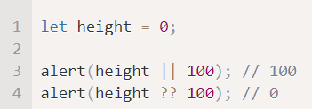

# Подключать скрипты

- внутри head
- внутри body (как внешний файл)
- внутри body (писать код в теге script)

Заметка: если атрибут src установлен, то содержимое тега script игнорируется

# use scrict 

- деректива
- находится в начале скрипта (выше могут быть только комментарии)
- задействует современный код

Пример: переменная без ключевых слов **let, const, var** объявить нельзя

Заметка: когда код будет состоять из классов и модулей, use strict можно опускать

# Переменные 

# Типы данных

JS имеет 8 основных типов:
- число
- BigInt - для хранения больших чисел
- строка
- логический тип
- null - ссылка на несуществующий объект
- undefined - значение не было присвоено
- Object - для хранения комплексных данных
- Symbol - для уникальных id в объектах

## Оператор typeof

- возвращает тип аргумента

Имеет две формы:
- typeof x
- typeof (x)

# Взаимодействие: alert, prompt, confirm

- alert - показывает сообщение
- promt - принимает два параметра (title, default)

Показывает сообщение и запрашивает ввод текста от пользователя. Возвращает напечатанный в поле ввода текст или null, если была нажата кнопка «Отмена» или Esc с клавиатуры.

- confirm - показывает сообщение и ждёт, пока пользователь нажмёт OK или Отмена. Возвращает true, если нажата OK, и false, если нажата кнопка «Отмена» или Esc с клавиатуры.

Ограничения на модальные окна:
- расположение менять нельзя
- визуальное отображение менять нельзя

# Преобразование типов

- alert - автоматически приводит любое значение к строке
- математические операторы преобразуют значения к числам

## Строковое преобразование

- String(value)

## Численное преобразование

- в математических выражениях
- Number(value)
- унарный плюс (если операнд не число)

Правила численного преобразования:

## Логическое преобразование

- в логических операциях
- Boolean(value)
- конструкция if(...)

Правила логического преобразования:

# Операторы сравнения

## Сравнения строк

- используется кодировка Unicode (сравниваются по коду во внутренней таблице кодирования)

## Сравнение разных типов

- JS приводит каждое из них к числу

## Строго сравнение

- строгое сравнение - без приведения типов

# Логические операторы

## || (ИЛИ)

- || (ИЛИ) находит первое истинное значение
    1) вычисляется слева направо
    2) каждый конвертируется в логический тип, если true - возвращается исходное значение операнда
    3) если все false, возвращается последний из них

## && (И)

- && (И) находит первое ложное значение
    1) вычисляется слева направо
    2) каждый конвертируется в логический тип, если false - возвращается исходное значение операнда
    3) если все true, возвращается последний из них

## ! (НЕ)

Действия:
1) приводит к логическому типу
2) затем возвращает противоположное значение

# Оператор объединения с null '??'

- a ?? b - если **а** определено, то **а**. В противном случае **b**

## Отличие от оператора || (ИЛИ)

- ?? - возвращает первое **определенное** значение
- || - возвращает первое **истинное** значение

# Циклы

- while
- for
- do..while
- for..in - для перебора свойств объекта, массива (но не следует применять для массивов)
- for..of - для перебора элементов массива
    1) не предоставляет доступа к номеру текущего элемента, в отличие от for

В циклах есть операторы: break, continue

# Функции

- имеет доступ к внешним переменным, и может менять их значение

- использует внешнюю переменную, если не определена локальная
- принимает параметры
- параметры по умолчанию

- возвращает значения (c помощью return)

Виды функций:
- function declaration

Можно использовать во всем скрипте

- function expression

Создается, когда выполнение кода доходит до него, и затем уже может использоваться

- arrow functions (слева параметры, справа выражение)
    1) у стрелочных функций нет this

Заметка:

## Функции-«колбэки»

Функция, которая передается в качестве параметра другой фу

