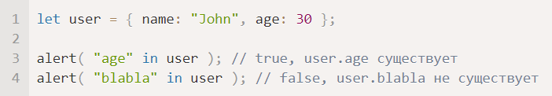
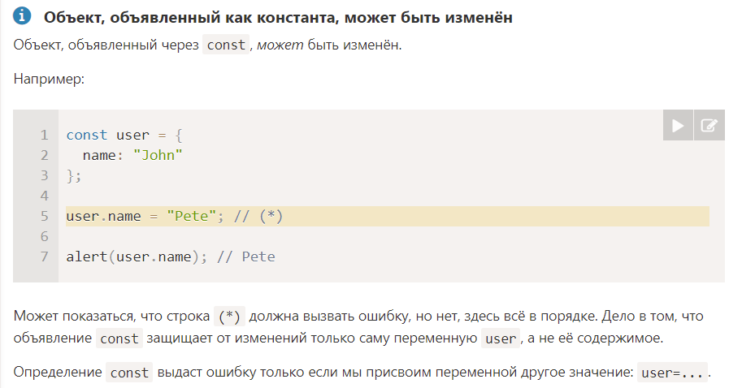
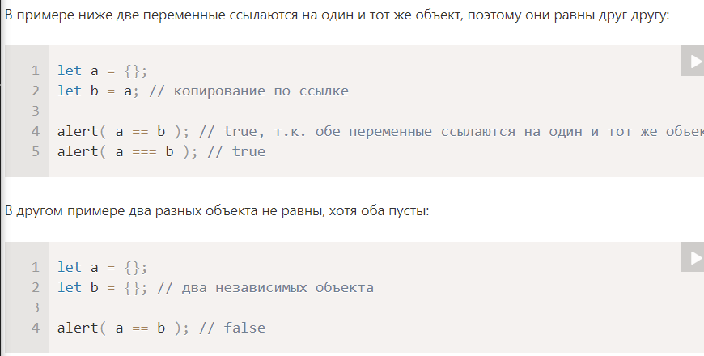
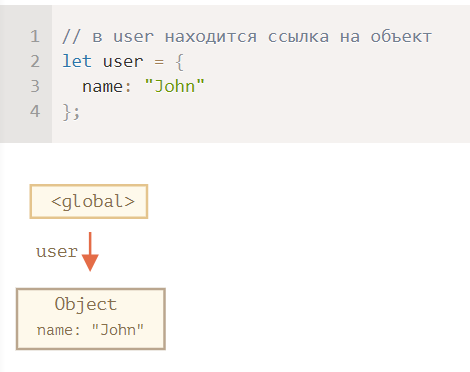
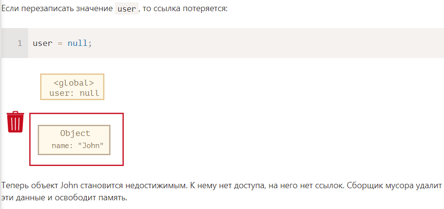
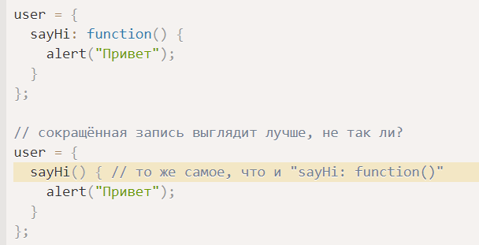
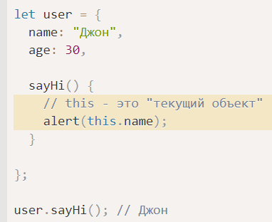
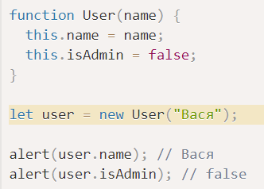
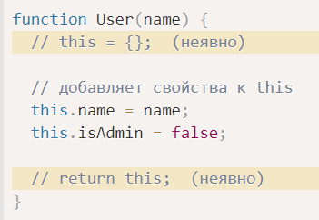

# Объекты

- объекты - ассоциативные массивы с рядом дополнительных возможностей
- для хранения комплексных данных
- данные представлены в виде пары ключ-значение
- оператор in позволяет проверить существование свойства

Два вида синтаксиса:
- new Object()
- {}

Манипуляции с объектом:
- можно добавлять свойства
- можно удалять свойства (delete user.name)

Заметка:

# Копирование объектов и ссылки

Вспомнить теорию из C# по значимым и ссылочным типам.

- объекты - ссылочные типы данных
- примитивные типы - значимые типы данных

## Сравнение по ссылке

- Два объекта равны только в том случае, если это один и тот же объект

## Object.assign

- поверхностное копирование

# Сборка мусора

В JS есть такой принцип достижимости

Пример:

## Алгоритм сборки мусора

- Сборщик мусора помечает корневые объекты
- Затем идет по их ссылкам и помечает все найденные объекты
- Затем идет по ссылкам помеченных объектов
- И так далее, пока не будут посещены все ссылки
- Все непомеченные ссылки удаляются

# Методы объекта, this

- можно создавать методы в объекте

## Слово this

- для доступа к информации внутри объекта, метод может использовать this

# Конструкторы, создание объектов через "new"

## Функция-конструктор

Обычные функции, для создания множества однотипных объектов

- имя функции с большой буквы
- вызывается с помощью new

Когда функция вызывается как new, происходит следующее:
1) создается пустой объект, присваивается this
2) выполняется код функции, модифицируется this
3) возвращается this

