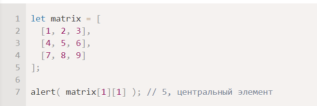
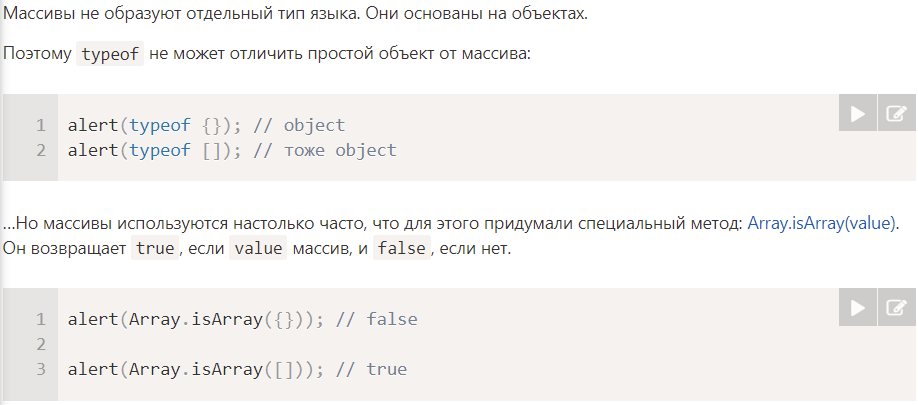
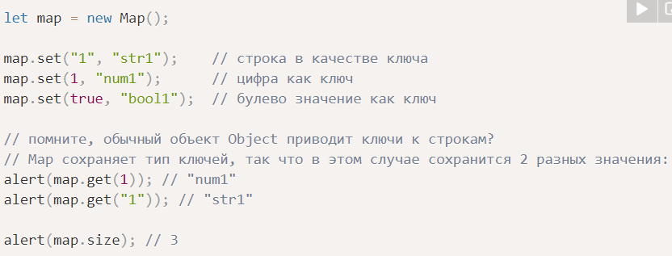
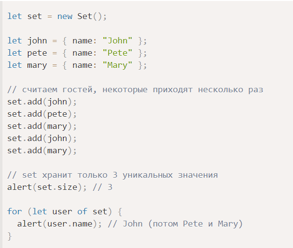

# Массивы

- особый подвид объектов
- для хранения набора данных
- может хранить элементы любого типа

Способы объявления:
- new Array() - создает массив с заданной длинной, но без элементов
- []

## Методы массива

- push/pop (в конец, из конца) - работают быстро
- unshift/shift (в начало, из начала) - работают медленно
    1) удалить
    2) сдвинуть, пронумеровать
    3) обновить свойство length

## Многомерные массивы 

## Array.isArray

# Map и Set

- Map - коллекция ключ-значение, как и Object. Только в Map ключи любого типа

- Set - коллекция значений, где каждое значение может появляться только один раз

# WeakMap и WeakSet

- WeakMap - в отличие от Map, ключи должны быть объектами
- WeakSet - в отличие от Set, значения только объекта

# Формат JSON, метод toJSON

- JSON.stringify - для преобразования объекта в JSON
- JSON.parse - для преобразования JSON в объект