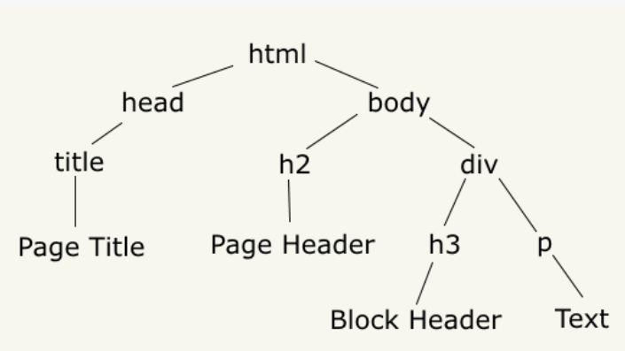
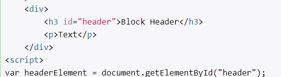
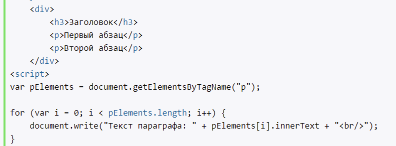
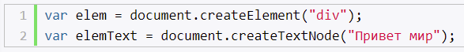

# Введение в DOM

- описывает структуру страницы в виде древовидного дерева
- разработчики могут получить доступ к отдельным элементам страницы

Отличие от BOM: BOM доступ к браузеру и его свойствам в целом, то DOM - доступ к отдельной странице и ее элементам.

# Объект document. Поиск элементов

- объект document, определен в глобальном объекте window
- объект document ряд свойств и методов для управления элементами страницы

## Поиск элементов

- getElementById - выбирает элемент по id
- getElementsByTagName - выбирает все элементы по тегу
- getElementsByClassName - выбирает все элементы по классу
- querySelector - выбирает первый элемент, который соответствует селектору
- querySelectorAll - выбирает все элементы, которые соответствуют селектору

## Свойства объекта document

- body - доступ к элементу body
- documentElement - доступ к элементу html
- images - содержит коллекцию всех img
- forms - содержит коллекцию всех form
- links
- anchors

# Объект Node. Навигация по DOM

Каждый отдельный узел, будь то html-элемент, его атрибут или текст, в структуре DOM представлен объектом Node. Этот объект предоставляет ряд свойств, с помощью которых мы можем получить информацию о данном узле

- nodeName
- nodeType
- nodeValue
- firstChild
- lastChild

# Создание, добавление и удаление элементов веб-станицы

Для создания элементов, объект document имеет следующие методы:
- createElement(elementName)
- createTextNode(text)

**Добавить информацию, по добавлени, удалению, замены позже...**

# Свойства innerText и innerHTML

- innerText - текстове содержимое html-элемента
- innerHTML - для установки кода html