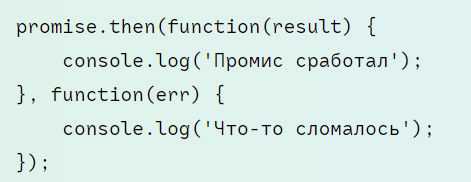

# Замыкания

Конструкция, когда функция, созданная в одной области видимости, запоминает свое лексическое окружение даже в том случае, когда она выполняется вне своей области видимости

Замыкание, технические включает три компонента:
- внешняя функция - определяет лексическое окружение
- перменные - определены внутри внешней функции (лексическое окружение)
- вложенная функция - которая использует эти переменные (лексическое окружение)

# Куки

- document.cookie
- размер не более 4096 байт
- при каждом запросе передаются серверу

Содержание куки:
- имя
- значение
- срок окончания действия (если не установлен, удаляются при закрытии браузера)
- путь
- домен
- secure 

secure задает использование SSL (SecureSockets Layer) и подходит для сайтов, использующих протокол https. Если значение этого параметра равно true, то куки будут использоваться только при установке защищенного соединения ssl. По умолчанию данный параметр равен false

# Web Storage

- концепция хранения данных
- данные хранятся в виде пары ключ-значение

Состоит из двух компонентов:
- local storage
    1) данные хранятся на постоянной основе
    2) не удаляются автоматически и не имеют срока действия
    3) не передаются при каждом запросе на сервер
    4) объект в Chrome, Firefox - 5мб, в IE - 10 мб
- session storage - временное хранилище данных, которое удаляется после закрытия браузера 

Методы:
- setItem
- getItem
- removeItem
- clear

# XMLHttpRequest

Встроенный в браузер объект, для отправки запросов на сервер без перегрузки страницы

Два режима работы: синхронный и асинхронный (устанавливает при инициализации)

Чтобы сделать запрос:
1) создать запрос
2) проинициализировать
3) отправить запрос
4) слушать ответ на запрос

# Ajax

- технлогия для отправки асинхронных запросов к серверу, без перегрузки страницы
- в основе лежит использование объекта XMLHttpRequest

Что можно сделать с помощью ajax:
- живой поиск
- динамическая подгрузка данных

Асинхронный запрос - запрос, который выполняется в фоновом режиме и не мешает пользователю взаимодействовать со страницей

# Fetch

- альтернатива ajax
- построен на основе промисов

# Промисы

- это объект, представляющий завершение или сбой асинхронной опирации

Конструктор Promise принимает один аргумент (callback) с двумя параметрами (resolve, reject)

Таким образом у промиса есть три состояния:
- ожидание ответа pending
- успешное выполнение resolve
- выход ошибкой reject

## Потребители: then, catch, finally

Метод then, аргументы:
1) первый агрумент - функция, если успех
2) второй аргумент - функция, если ошибка

Вызов .catch(f) – это сокращённый, «укороченный» вариант .then(null, f).

Вызов .finally(f) похож на .then(f, f), в том смысле, что f выполнится в любом случае, когда промис завершится: успешно или с ошибкой.