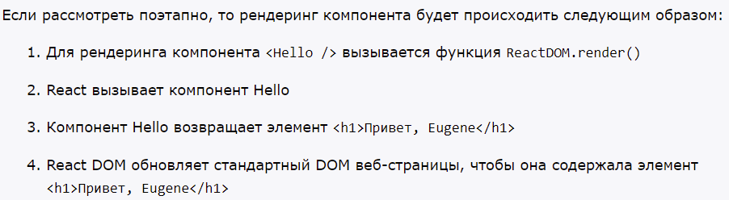
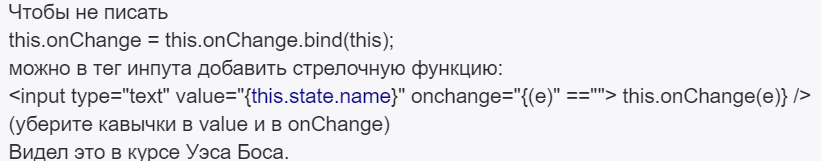
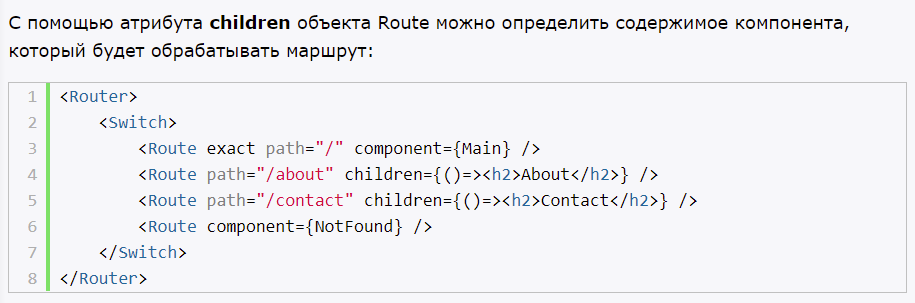
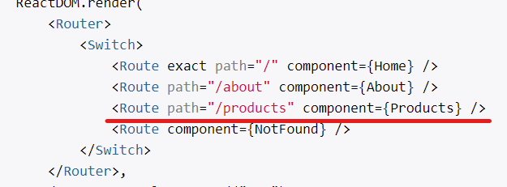
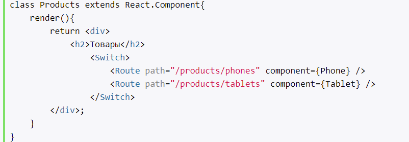
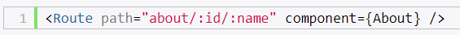

# Введение в React

## Что такое React. Первое приложение

- библиотека JS, для создания пользовательского интерфейса
- для создания SPA

Виртуальный DOM.

Виртуальный DOM копия DOM.

Если происходят изменения, то изменяется сначала VDOM. Потом состояние VDOM сравнивается с текущим состояним DOM. И если эти состояния различаются, то React находит минимальное кол-во манипуляций 

- работа с компонентами - можно создать их и переносить из проекта в проект
- использование JSX (JS, XML)
- для рендеринга элемента на веб-странице применяется метод `ReactDOM.render()`
- для компиляции нужен компилятор babel 

## Основы JSX

Описание кода на JS и XML

При работе с JSX:
- className, не class
- style - принимает объект
- camelCase

## JSX и Babel

Babel - для компиляции JSX в JS

# Основы React

## Рендеринг элементов

- элементы React неизменяемые. Чтобы изменить, следует его пересоздать.

При обновлении элемента виртуальный React DOM сравнивает текущее состояние элемента с его предыдущим состоянием и при наличии изменений применяет их к веб-странице и обновляет стандартный DOM. 

## Компоненты

- в React используются компоненты, чтобы строить сложную разметку HTML. Компоненты проще обновлять и использовать повторно

создание компонентов:
- функциональный
- через классы
- стрелочные функции

## Props

- входные данные
- набор значений, которые ассоциированы с компонентом
- можно установить значения по умолчанию
- только для чтения

## События

Условия:
- camelCase
- в обработчик события передается функция компонента, а не строка

- this - указывает на текущий объект
- e - параметр функции - информация о событии

## State

- объект, с набором свойств
- определяется в конструкторе компонента, и доступен только из компонента
- можно изменять
- описывает какие-то визуальные свойства элемента, которые могут изменяться при взаимодействие с пользователем

## Жизненный цикл компонента

При первом вызове компонента:
- constructor(props)
- statis getDerivedStateFromProps(props, state) - перед render
- render()
- componentDidMount() - после рендеринга
- componentWillUnmount() - перед удалением компонента из DOM

При обновлении компонента
- static getDerivedStateFromProps(props, state)
- shouldComponentUpdate(nextProps, nextState) - каждый раз при обновлении
- render()
- getSnapshotBeforeUpdate(prevProps, prevState) - перед обновлением
- componentDidUpdate(prevProps, prevState, snapshot) - после обновления

## Управление ресурсами

В приложениях React при удалении компонентов важно освобождать ресурсы, которые используются этими компонентами. Для управления ресурсами можно задействовать функции жизненного цикла компонента.

Создание подобных ресурсов в компонентах React производится в функции componentDidMount(). А для освобождения ресурсов применяется функция componentWillUnmount().

В приложениях со множеством компонентов очень важно освобождать используемые системные ресурсы, когда компоненты удаляются.

Первоначальный рендеринг компонента в DOM называется «монтирование» (mounting). Нам нужно устанавливать таймер всякий раз, когда это происходит.

Каждый раз когда DOM-узел, созданный компонентом, удаляется, происходит «размонтирование» (unmounting). Чтобы избежать утечки ресурсов, мы будем сбрасывать таймер при каждом «размонтировании».

# Формы 

## Refs

- Атрибут для получения введенных данных
- применяется к любому элементу страницы
- нельзя установить значение по умолчанию, с помощью атрибута value

использование:
- Управление фокусом, выделение текста или воспроизведение медиа.

# Маршрутизация

## Определение маршрутов

Сопоставление запросов с компонентами

- модуль react-router

Основные объекты:
- BrowserRouter - определяет набор маршрутов
- Route - маршрут представляет объект Route
- Switch - для выбора маршрута (первый попавшийся)

- атрибут children 

Квалификаторы:
- exact - точное совпадение маршрута, можно в конце косую черту
- strict - точное совпадение маршрута

## Дочерние маршруты

- отсчитываются от главного маршрута

## Создание ссылок

- для создания ссылки применяется объект Link
- также можно использовать объект NavLink (также как и Link, + стилизация ссылки)

## Параметры маршрутов

- форма параметров `:название_параметра`

- для получения параметров в компоненте `this.props.match.params`
- запрос, все его данные доступны в компоненте через объекты location и match
- можно использовать необязательные параметры (`?`)
- ограничение параметров (регулярки)
- сегментация параметров (дефис, `-`)

## Переадресация

- компонент Redirect
- Компонент Redirect определяет два атрибута: to (новый путь) и from (путь, с которого надо выполнить переадресацию)