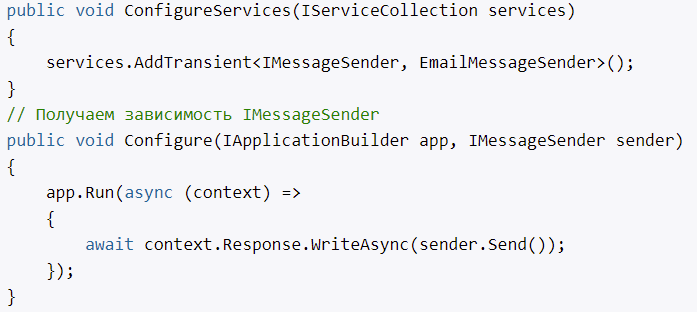
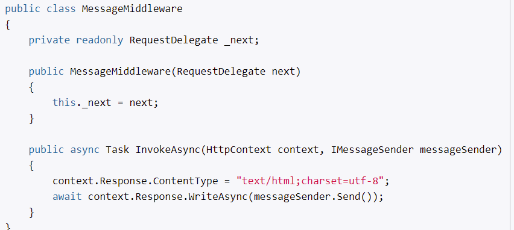
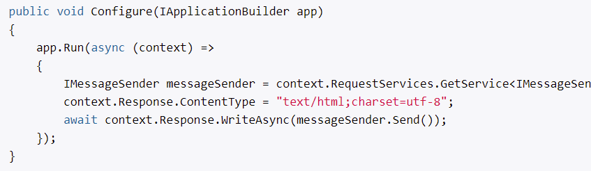
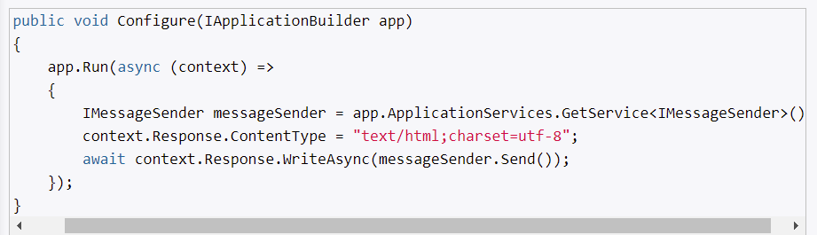

# Сервисы и метод ConfigureServices

DI - механизм, который позволяет сделать взаимодействующие объекты слабосвязанными. Такие объекты, связаны между собой через абстракции, например, через интерфейсы.

Для установки зависимостей используются контейнеры IoC (Inversion of Control). Это такие фабрики, которые устанавливают зависимости между абстракциями и конкретными объектами. Примером таких контейнером могут быть (Unity, Autofac, Ninject).

ASP.NET Core имеет свой контейнер внедрения зависимостей, который представлен интерфейсом **IServiceProvider**.

- сервисы устанавливаются в ConfigureServices
- IServiceCollection имеет ряд встроенных сервесов
- можно создавать свои сервисы

## Информация о сервисах

- тип сервиса
- тип реализации сервиса
- жизненный цикл сервиса

# Создание своих сервисов

- можно использовать встроенные сервисы
- можно создавать свои
- для сервисов, создают методы расширения

Шаги:
1) определим интерфейс
2) определить класс, который будет реализовать данный интерфейс
3) зарегистрируем эти объекты (будет сервис)

# Передача зависимостей

- через конструктор
- через параметр метода Configure класса Startup

- через папаметр метода Invoke компонента middleware

Подобно тому, как зависимости передаются в метод Configure в классе Startup, точно также их можно передавать в метод Invoke компонента middleware

**Передача зависимости через конструктор middleware больше подходит для сервисов с жизненным циклом Singleton, которые создаются один раз для всех последующих запросов.**

- через свойство RequestServices объекта HttpContext
    1) GetService - если данного сервиса нет (null)
    2) GetRequiredService - если данного сервиса нет (исключение)

- через свойство ApplicationServices объекта IApplicationBuilder

# Жизненный цикл зависимостей

- transient - при каждом обращении к сервису, создается новый объект сервиса. В течении запроса может быть несколько обращений к сервису, соответственно при каждом будет создаваться новый объект
- scoped - для каждого запроса будет создаваться свой объект сервиса. В течении запроса несколько обращений к сервису, будет использоваться один и тот же объект сервиса
- singleton - объект создается при первом обращении к нему, все последующие запросу используют ранее созданный объект

мы не можем по умолчанию передавать в конструктор singleton-объекта scoped-сервис.