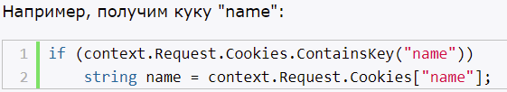

# HttpContext.Items

В объекте HttpContext определена коллекция Items, которая представляет собой словарь типа `IDictionary<object, object>`. Эта коллекция предназначена для таких данных, которые непосредственно связаны с текущим запросом. После завершения запроса все данные из HttpContext.Items удаляются. Каждый объект в этой коллекции имет ключ и значение. И с помощью ключей можно управлять объектами коллекции.

В каком случае мы можем применить данную коллекцию? Например, если у нас обработка запроса вовлекает множество компонентов middleware, и мы хотим, чтобы для этих компонентов были доступны общие данные, то как раз можем применить эту коллекцию.

# Куки

- хранятся на компьютере
- могут устанавливаться как на сервере, так и на клиенте
- куки хранятся на клиенте
- куки посылаются с каждым запросом на сервер
- максимальный размер 4096 байт
- куки - строковые значения

**HttpContext.Request.Cookies** - коллекция типа **IRequestCookieCollection**. В которой каждый элемент **KeyValuePair<string, string>**

- Request.Cookies - для получения кук
- Response.Cookies - для установки кук

# Сессии

- ряд последовательных запросов, совершенных в одном браузере в течение некоторого времени
- для сохранения каких-то временных данных
- каждая сессия имеет свой идентификатор, который сохраняется в куках

Для сохранения состояния сессии на сервере создается словарь или хеш-таблица, которая хранится в кэше, и которая существует для всех запросов из одного браузера в течение некоторого времени.

На клиенте хранится идентификатор сессии в куках. Этот идентификатор посылается с каждым запросом на сервер. Сервер использует этот ID для получения данных из сессии. Эти куки удаляются при завершении сессии. Если сервер получает куки, которые установлены уже для истекшей сессии, то для этих кук создается новая сессия.

Сервер хранит данные сессии в течении ограниченного промежутка времени после последнего запроса (примерно 20 минут (можно изменить))

Данные сессии не разделяются браузерами

Чтобы добавить сессии в проект надо их зарегистрировать.
1) services.AddSession();
2) app.UseSession();