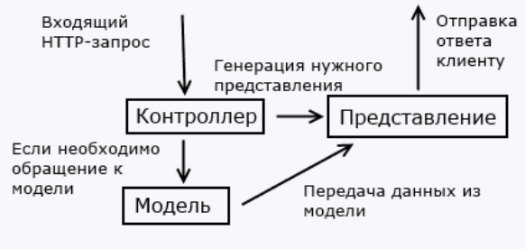

# Особенности ASP.NET MVC. Что нового в MVC 5

- для создания веб-приложений
- поддержка архитектурного шаблона MVC (разделение ответственности, тестируемость)

- контроллер - класс, получает запрос и обрабатывает его
- модель - класс, описывает данные приложения (независимый компонент, изменение в контроллере или представлении не затрагивают модель)
- представления - файл, визуальная часть
- контроллер и представления - независимые компоненты

Что нового в MVC 5:

- во-первых это уже не новое
- Identity
- Bootstrap
- фильтры аутентификации и переопределение фильтров
- атрибуты маршрутизации