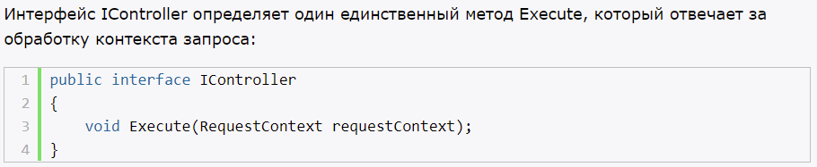
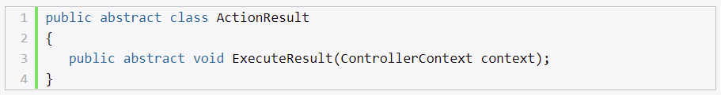
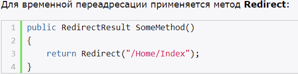
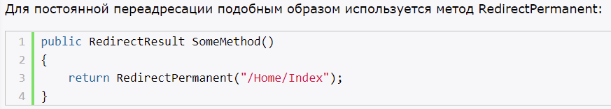
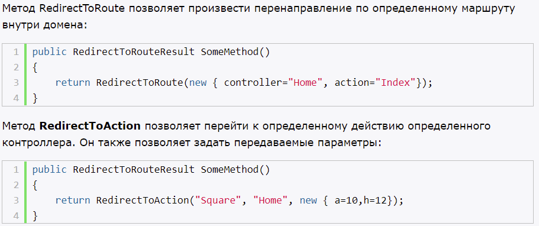
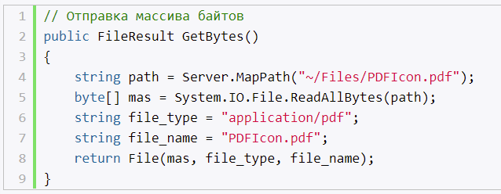
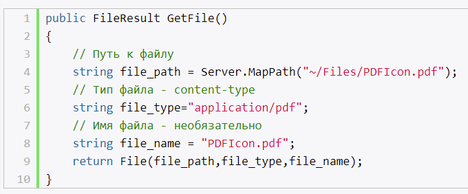

# Основы контроллеров

- получает ввод пользователя, обрабатывает его и посылает обратно результат обработки, например, в виде представления.
- класс, наследуется от (abstract) Controller
- (abstract) Controller от (abstract) ControllerBase
- (abstract) ControllerBase реализует IController

# Методы действий и их параметры

- методы контроллера, которые обрабатывают запросы по определенному URL
- обрабатывают GET, POST, PUT, DELETE запросы
- всегда public (контроллер может содердать и обычные методы, но такие используются в вспомогательных целях)
- данные в контроллер передаются (в URL, в теле)

## Получение данных из контекста запроса

- можем получать данные связанные с запросом из объектов контекста запроса
- request, response, httpContext, server, routedData

# Результаты действий

- контроллер формирует ответ в виде результата дейсвия
- объект класса, производного от (abstract) ActionResult
- можно создать свои результаты действия

## Встроенные классы, производные от ActionResult

# ViewResult и генерация представлений

- производит рендеринг представления в веб-страницу и возвращает ее в виде ответа клиенту

## Передача данных из контроллера в представление

### **ViewData**

- словарь
- производный от ViewDataDictionary
- для передачи данных из контроллера в представление
- время жизни ограничено текущим запросом
- если redirect, то ViewData равно null
- необходимо приводить типы и проверять на null, чтобы избежать ошибки

### ViewBag

- динамическое свойство, представляет собой обертку вокруг ViewData, и также используется для передачи данных из контроллера в соответствующее представление;
- Жизненный цикл также ограничивается текущий запросом;
- При редиректе значение также оборачивается в null;
- Нет необходимости в приведении типов для получения данных

### TempData

- словарь
- производный от TempDataDictionary
- для передачи данных из текущего запроса в последующий
- необходимо приводить типы и проверять на null, чтобы избежать ошибки
- для хранения одноразовых сообщений
- использует сессию для хранилища, после перенаправления, данные удаляются

### Session

- необходимо приводить типы и проверять на null, чтобы избежать ошибки

# Переадресация и отправка кодов статуса и ошибок

- два вида переадресации:
- 301 - документ окончательно перемещен в другое место

неправильно настроенная постоянная переадресация может ухудшить позиции в поисковиках или способствовать полному выпадению сайта из поиска.

- 302 - документ временно

- redirectToRouteResult - выполняет более детальную настройку перенаправлений

# Отправка файлов в ASP.NET MVC 5

- FileContentResult - отправляет массив байт, считанный из файла

- FilePathResult - отправка файла напрямую с сервера

- FileStreamResult - создает поток Stream, с помощью которого считывает и отправляет файл

# Контекст запроса HttpContext. Куки. Сессии

- ControllerContext - данные запроса по отношению к данному контроллеру
- HttpContext - данные конкретного запроса

## Куки

- текстовый файлы у нас на компьютерах (в них хранится информация о наших предыдущих действиях на сайтах)
- объем данных, создается сервером и хранится на клиенте
- размер 4096 байт

Для чего:
- аутентификации пользователя
- сбора и анализа статистики
- персонализация 

Что можно увидеть в файле куки:
- имя
- значение
- домен
- время жизни
- размер файлов куки в байтах

### Как работают cookies

- отправляются с каждым запросом и ответом
- бывают временными (удаляются, при закрытии вкладки сайта) и постоянными (остаются на компьютере, когда закрываем вкладку с сайтом)

## Сессия

- http не имеют состояний
- механизм, позволяет отследить запросы от одного браузера и сохранить некоторую информацию во время переходов по страницам сайта

Завершение сеанса:
- таймаут
- в определенное время суток
- при закрытии браузера

## Кэш

Благодаря кэшированию данных, браузер сохраняет часть информации локально на компьютере пользователя. Теперь нет необходимости в повторной загрузке одной и той же информации, нужные данные просто подгружаются из памяти персонального компьютера без использования интернета.

- имеет ограниченный размер

## Заключение

Итак, куки и сессии это что-то вроде временных таблиц в базе данных, в которых вы можете хранить данные, уникальные для конкретного пользователя, и которые будут храниться пока вы их не удалите вручную, или пока не закончится их срок действия, или до окончания сессии (в зависимости от того, как вы это определите).