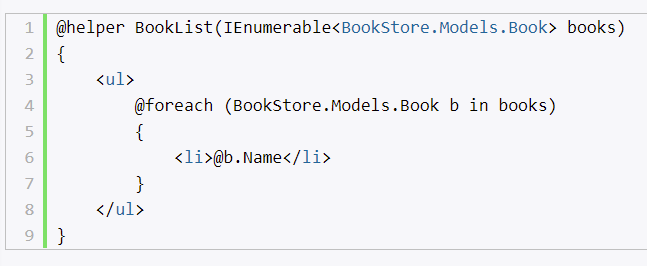
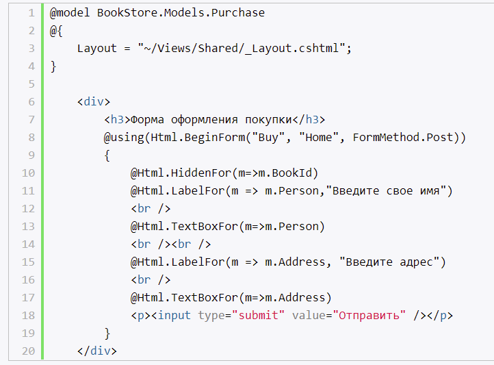

# **`Введение в представления`**

- файлы .cshtml
- при компиляции генерируется в класс (который наследуется от WebViewPage), затем этот класс компилируется

## **Синтаксис Razor**

- движок представления
- с помощью него можно использовать код C# вместе с html

# **`Строго типизированные представления`**

- данные в представление передаются через параметр метода View
- на представлении данные можно получить через объект Model

# **`Мастер-страницы`**

- представление, которое может включать в себя другие представления
- RenderBody() - placeholder, на место которого будет вставлено другое представление, использующее данную мастер-страницу
- можно определить множество мастер-страниц
- может содержать секции

## **ViewStart**

- представление
- код этого представления выполняется до кода любого из представлений, расположенных в том же каталоге

# **`Частичные представления`**

- для встраивания в другие, обычные представления
- PartialViewResult
- как и обычное, только для него не определяется мастер-страница
- можно создавать строготипизированными

## **Html.Render**

- строчное выражение
- возвращает строку

## **Html.RenderPartial**

- блочный (в фигурных скобках)
- возвращает void
- пишет сразу в выходной поток (отрабатывает быстрее)

# **`HTML-хелперы`**

- генерируют html

## **Строчные хелперы**

- похожи на обычные методы, только начинаются с тега @helper
- создал раз и используй многократно
- хелперы выносятся в отдельный фолдер

## **Определение хелпера в классе C#**

- создается класс с методом расширения
- this HtmlHelper

# **`Строго типизированные хелперы`**

- в качестве параметря лямбда-выражение, в котором указывается свойство модели, к которому должен быть привязан данных хелпер
- используются только в строго-типизированных представлениях
- c суффиксом For

