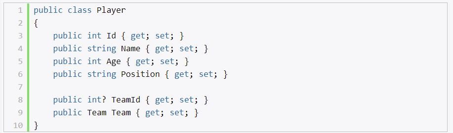
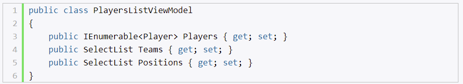

# **`Модели и БД`**

- классы
- описывают логику данных
- хранятся в БД

# **`Шаблонные хелперы`**

- не генерируют определенный html элемент
- генерируют элемент html, который наиболее подходит данному свойству, исходя из его типа и метаданных

Примеры шаблонных хелперов (для одного свойства):
- Display/For
- Editor/For
- DisplayText/For

Примеры шаблонных хелперов (для всех свойств):
- DisplayForModel
- EditorForModel

# **`Domain Model и View Model`**

Модель Player в данном случае представляет модель домена, ее объекты хранятся в базе данных и чтобы их получить, мы обращаемся через контекст данных к БД.

Это модель представления или view model, которая предназначена конкретно для вывода данных в некоторое представление.