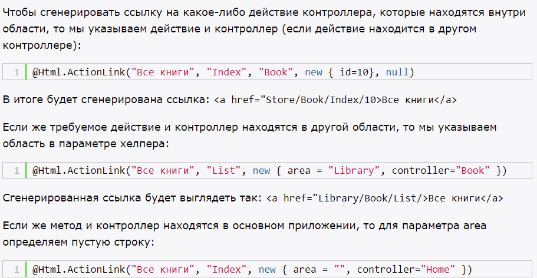

# **`Определение маршрутов`**

- все определения маршрутов находятся в классе RouteConfig, в методе RegisterRoutes
- шаблон url состоит из сегментов

При получении запроса механизм маршрутизации парсит строку URL и помещат значения маршрута в словарь RouteValueDictionary, доступный через контекст запроса RequestContext.

# **`Работа с маршрутами`**

- для создания маршрутов используется метод MapRoute

- Движок маршрутизации использует значение по умолчанию только в том случае, если все последующие параметры также имеют значения по умолчанию.

## **Сопоставление запросов с файлами на диске**

- смотрит, совпадает ли запрос с определенным файлом, хранящимся на сервере
- если файла не находит, тогда сопоставляет запрос с определенными маршрутами

## **Порядок определения новых маршрутов**

- порядок важен
- более специфические маршруты помещаются перед более общими

Т.к. если маршрут не найдет то, что обработает запрос - вернет ошибку

## **Получение переданных параметров**

- объект RouteData - переданные значения для параметров маршрута

## **Передача произвольного количества параметров в запросе**

- мы можем обозначить любое количество сегментов в запросе, чтобы не быть жестко привязанным к числу сегментов с помощью параметра {*catchall}

# **`Создание ограничений для маршрутов`**

- настраивается в секции constraints
- можно создавать собственные ограничения (реализовать интерфейс IRouteConstraint)

## **Игнорирование запросов**

- routes.IgnoreRoute("Home/Index/12");

# **`Генерация исходящих адресов URL`**

## **Html.ActionLink**

- хелпер
- создает гиперссылку на действие контроллера
- @Html.ActionLink("Жми здесь", "Show")
- @Html.ActionLink("Список книг", "List", "Book")

## **Html.RouteLink**

- хелпер
- принимает имя маршрута
- не требует аргументов для имени контроллера и имени действия

## **URL-хелперы**

- не возвращают html
- задают пути URL и возвращают их в виде строк

Три типа URL-хелпера:
- Action - похож на actionLink
- Content - преобразует относительные пути в абсолютные
- RouteUrl - похож на routeLink

# **`Области`**

- фактически область мини-проект, в котором уже есть структура папок (MVC)
- также создается класс регистрации области
- в классе определены свои маршруты

Чтобы избежать двойственности методов контроллеров, в файле RouteConfig надо указывать пространство имен Home, который будет вызываться при запуске приложения

## **Генерация ссылок в областях**

# **`Процесс маршрутизации`**

1. Модуль UrlRoutingModule пытается сопоставить текущий запрос с маршрутами в таблице RouteTable.

2. Если сопоставление завершилось удачно, то модуль маршрутизации выбирает обработчик маршрутов сопоставленного маршрута - объект IRouteHandler.

3. Затем у объекта IRouteHandler вызывается метод GetHandler, который возвращает объект IHttpHandler, используемый для обработки запроса.

4. У обработчика IHttpHandler вызывается метод ProcessRequest для обработки запросов.

Нужно собственно два класса: класс, реализующий интерфейс IHttpHandler, который и будет обрабатывать запрос; и класс, реализующий интерфейс IRouteHandler, который сопоставляется с маршрутом, и вызывает первый класс.

# **`Атрибуты маршрутизации`**

- сопоставляют маршрут с методом контроллера
- позволяют не определять дополнительный маршрут в классе RouteConfig
- сопоставление прямо в коде контроллера

В RouteConfig надо прописать метод routes.MapMvcAttributeRoutes();, который подключает в систему маршрутизации приложения функциональность атрибутов маршрутизации.