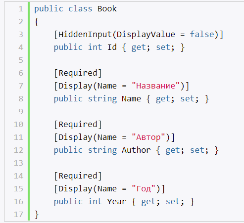
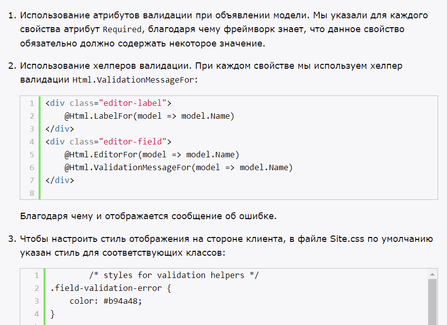
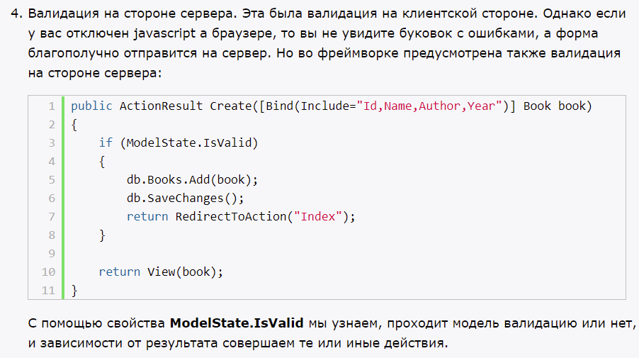
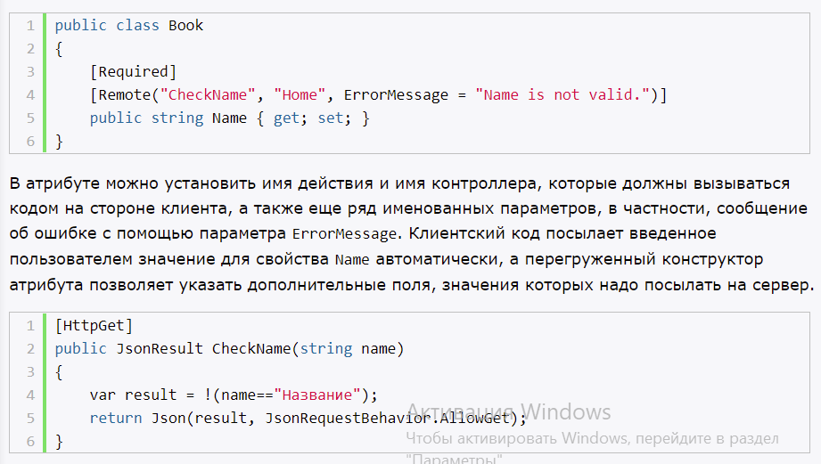
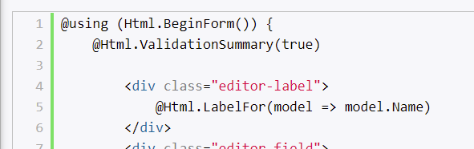
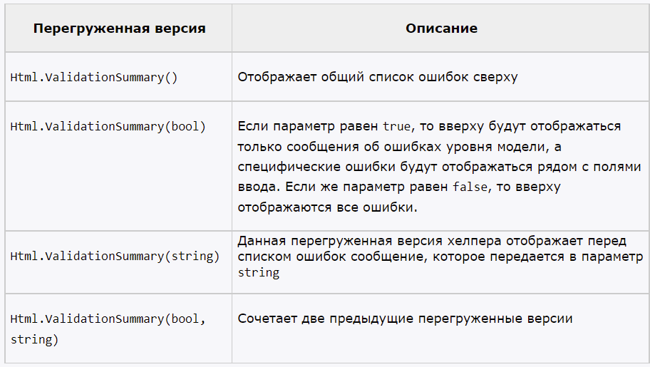
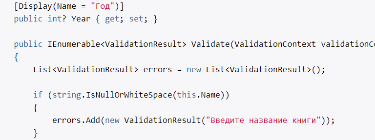

# **`Аннотации данных для отображения свойств`**

- атрибуты
- System.ComponentModel.DataAnnatations

Примеры атрибутов
- Display - отображение свойства на странице
- HiddenInput - скрывает поле (еще видно хелперам)
- ScaffoldColumn - полностью скрывает свойство от хелперов
- DataType - предоставляют CLR информацию об использовании свойства (допустим, Password)
- UIHint - указывай, какой шаблок будет использоваться при создании разметки html для данного свойства

# **`Основы валидации`**

# **`Атрибуты валидации`**

- для валидации модели

Атрибуты:
- Required
- RegularExpression
- StringLength
- Range (как с целыми, так и вещественными)
- Compare
- Remote (System.Web.Mvc) - выполняет валидацию на стороне клиента, с обратными выжовами на сервер

# **`Валидация модели в контроллере`**

- ModelState.IsValid
- объект ModelState запоминает все введенные значения и ошибки для свойств модели
- если есть ошибки, то свойство ModelState.IsValid = false
- можно проверять корректность значений отдельных свойств модели
- метод ModelState.AddModelError добавляет для свойства модели ошибку

# **`Отображение ошибок валидации`**

- для отображения ошибок использовать хелпер Html.ValidationSummary

- хелпер Html.ValidationMessageFor для вывода сообщения об ошибке для отдельного свойства, причем рядом с полем для ввода свойства, а не в сводке ошибок сверху

# **`Создание собственной логики валидации`**

Все атрибуты валидации образованы от базового класса `ValidationAttribute`, который находится в пространстве имен `System.ComponentModel.DataAnnotations`. Поэтому именно от этого класса мы будем образовывать свой атрибут.

Чтобы применить логику валидации, надо переопределить метод `IsValid`, предоставленный базовым классом.

## **`Самовалидация и IValidatableObject`**

- процесс, при котором модель запускает механизм валидации из себя самой. И сама инкапсулирует всю логику валидации.
- реализовать интерфейс IValidatableObject

