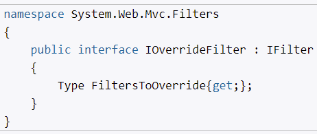

# **`Фильтры в ASP.NET MVC 5`**

- логика, которая отрабатывает до вызова действий контроллера
- реализованы как атрибуты
- применяются как ко всему классу, так и методам, свойствам, полям

## **Базовые типы фильтров**

Фильтры:
- аутентификации - аутентифицирован ли пользователь (выполняется до любого другого)
- авторизации - имеет ли пользователь доступ к ресурсу (после аутентификации и до любого другого)
- действий - применяется к действиям (до и после метода действий)
- результатов действий - к результатам дейсвий (до и после результата действий)
- исключений - для обработки исключений, выбрасываемых методом действий или результатом действий

] ограничивает доступ к методам контроллера: в данном случае они доступны только пользователю с логином eugene. И очевидно, что второй атрибут авторизации для метода Test работать не будет.

И чтобы решить данную проблему в MVC 5 была введена такая функциональность, как переопределение фильтров. Она подразумевает реализацию интерфейса IOverrideFilterS

Итак, создадим новый класс, реализующий данный интерфейс:

Таким образом, фильтр авторизации [Authorize(Users = "eugene")] будет применяться ко всем действиям контроллера, кроме метода Test.)