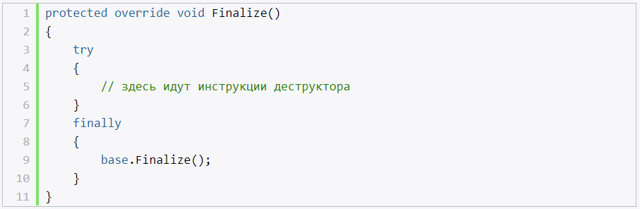

# Сборщик мусора в C#

При использовании переменных/параметров значимых типов в методе, все значения попадают в стек. После завершения метода, данные стека очищаются.

Для ссылочных типов, также отводится место в стеке, только там будет храниться не значение, а адрес на участок памяти в куче, в которой хранятся сами значения данного объекта. После завершения метода, данные стека очищаются (ссылки), но это не приводит к немедленной очистке самого участка памяти в куче. В последствии GC увидит, что на данный участок памяти больше ссылок нет, и очистит его

Сборщик мусора не запускается сразу после удаления из стека ссылки на объект, размещенный в куче. Он запускается в то время, когда среда CLR обнаружит в этом потребность, например, когда программе требуется дополнительная память.

Как правило, объекты в куче располагаются неупорядочено, между ними могут иметься пустоты. Куча довольно сильно фрагментирована. Поэтому после очистки памяти в результате очередной сборки мусора оставшиеся объекты перемещаются в один непрерывный блок памяти. Вместе с этим происходит обновление ссылок, чтобы они правильно указывали на новые адреса объектов.

Для крупных объектов существует своя куча - Large Object Heap. В эту кучу помещаются объекты, размер которых больше 85 000 байт. **Особенность этой кучи состоит в том, что при сборке мусора сжатие памяти не проводится по причине больших издержек, связанных с размером объектов**.

Несмотря на то что, на сжатие занятого пространства требуется время, да и приложение не сможет продолжать работу, пока не отработает сборщик мусора, однако благодаря подобному подходу также происходит оптимизация приложения. Теперь чтобы найти свободное место в куче среде CLR не надо искать островки пустого пространства среди занятых блоков. Ей достаточно обратиться к указателю кучи, который указывает на свободный участок памяти, что уменьшает количество обращений к памяти.

Кроме того, чтобы снизить издержки от работы сборщика мусора, все объекты в куче разделяются по поколениям. Всего существует три поколения объектов: 0, 1 и 2-е.

К поколению 0 относятся новые объекты, которые еще ни разу не подвергались сборке мусора. К поколению 1 относятся объекты, которые пережили одну сборку, а к поколению 2 - объекты, прошедшие более одной сборки мусора.

## Класс System.GC

Функционал сборщика мусора в библиотеке классов .NET представляет класс System.GC. Через статические методы данный класс позволяет обращаться к сборщику мусора. Как правило, надобность в применении этого класса отсутствует. Наиболее распространенным случаем его использования является сборка мусора при работе с неуправляемыми ресурсами, при интенсивном выделении больших объемов памяти, при которых необходимо такое же быстрое их освобождение.

# Финализируемые объекты

- управляемый код - очищается сборщиком мусора
- GC не знаешь как работать с неуправляемыми объектами.

Освобождение неуправляемых ресурсов подразумевает реализацию одного из двух механизмов:
- создание деструктора
- реализация интерфейса IDisposable

## Создание деструкторов

- метод
- носит имя класса
- перед именем знак тильды (~)
- не имеет модификатор доступа
- в него вкладывается логика освобождения неуправляемых ресурсов

При очистке, GC вызывает не деструктор, а метод Finalize(). То есть компилятор компилирует деструктор в конструкцию метода Finalize()

Метод Finalize уже определен в базовом для всех типов классе Object, однако данный метод нельзя так просто переопределить. И фактическая его реализация происходит через создание деструктора.

На уровне памяти это выглядит так: сборщик мусора при размещении объекта в куче определяет, поддерживает ли данный объект метод Finalize. И если объект имеет метод Finalize, то указатель на него сохраняется в специальной таблице, которая называется очередь финализации. Когда наступает момент сборки мусора, сборщик видит, что данный объект должен быть уничтожен, и если он имеет метод Finalize, то он копируется в еще одну таблицу и окончательно уничтожается лишь при следующем проходе сборщика мусора.

## Интерфейс IDisposable

И здесь мы можем столкнуться со следующей проблемой: а что если нам немедленно надо вызвать деструктор и освободить все связанные с объектом неуправляемые ресурсы? В этом случае мы можем использовать второй подход - реализацию интерфейса IDisposable.

- содержит метод Dispose(), в котором происходит освобождение неуправляемых ресурсов

## Комбинирование подходов

Короч, можно комбинировать подходы.

Еще один важный момент - вызов в методе Dispose метода GC.SuppressFinalize(this). GC.SuppressFinalize не позволяет системе выполнить метод Finalize для данного объекта.

- метод Dispose() в любой момент времени вызывает освобождение неуправляемых ресурсов, с другой стороны - программист, может забыть поставить в коде вызов метода Dispose()

# Конструкция using

- для автоматического вызова метод Dispose - конструкцию using
- using оформляет блок кода и создает объект некоторого класса, который реализует интерфейс IDisposable, в частности, его метод Dispose. При завершении блока кода у объекта вызывается метод Dispose.
- важно, что данная конструкция применяется только для классов, которые реализуют интерфейс IDisposable.