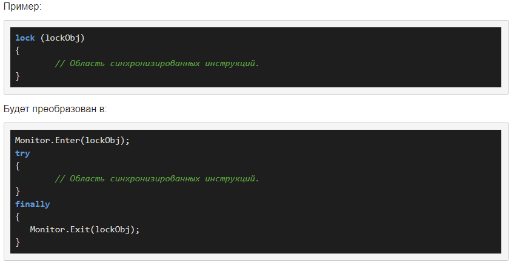

# Введение в многопоточность. Класс Thread

- при однопоточном, программа выполняет все инструкции последовательно
- многопоточность вводит такое понятие как поток
- многопоточность выделяет в приложении несколько потоков, которые выполняют различные задачи одновременно
- поток - некоторая часть кода программы
- при выполнении программы, потоку выделяется определенный квант времени
- функционал в System.Threading. В нем определен класс, представляющий отдельный поток Thread
- каждая программа - один поток, как минимум

## Проблема с разделяемыми ресурсами

- Главная проблема с потоками заключается в доступе разных частей кода к одному ресурсу.

## Класс Thread

Класс Thread содержит ряд свойств и методов, который позволяют управлять потоком и получать информацию о нем

Методы класса Thread:
- Sleep() - останавливает поток на определенное кол-во миллисекунд (метод у класса)
- Abort() - уведомляет среду CLR о том, что надо прекратить поток, однако прекращение работы потока происходит не сразу, а только тогда, когда это становится возможно
- Interrupt() - прерывает поток на некоторое время, то есть мы не устанавливаем это некоторое время (метод у объекта)
- Join() - блокирует выполнение для других потоков, пока поток, который вызвал данный метод не отработал до конца
- Start()

## Статус потока

- Статусы потока содержатся в перечислении ThreadState
- В процессе работы потока его статус многократно может измениться под действием методов

## Приоритеты потоков

- Приоритеты потоков располагаются в перечислении ThreadPriority
- lowest, belowNormal, normal, aboveNormal, highest
- по умолчанию normal
- на основе приоритета CLR выделяет определенное кол-во времени для его работы

# Создание потоков. Делегат ThreadStart

- для создания нового потока используется делегат ThreadState("метод")
- ThreadStart – инкапсулирует метод не принимающий параметров с возвращаемым значением типа void.
- может указывать на static так и не на static методы

# Потоки с параметрами и ParameterizedThreadStart

- делегат ParameterizedThreadStart
- ParametrizedThreadStart – инкапсулирует void-метод, принимающий параметр типа Object
- метод должен принимать только один объект типа object
- если параметр не один, то можно использовать классовый подход
- может указывать на static так и не на static методы

# Синхронизация потоков

Попытка двух потоков изменить данные одного объекта похожа на стремление двух человек писать на одном листке бумаге одновременно. Если координировать этот процесс – данные могут быть безнадежно испорчены.

Синхронизация возможна только над асинхронными методами. Потоки в С# асинхронны. Возможность синхронизации потоков в С# - это компромисс между строгой синхронизацией и асинхронностью, с возможностью оставить код безопасным.

Такой компромисс необходим, чтобы не потерять гибкость асинхронной обработки, и в то же время:

- Соблюсти порядок создания потоков, если необходимо чтобы один создавался после другого. Например: Будет неприятно если поток обрабатывающие входные данные запустится раньше чем поток, управляющий вводом данных.
- Создать безопасное обращение к общим ресурсам.

- ограничить доступ к разделяемым ресурсам на время их использования каким-нибудь потоком
- оператор lock определяет блок кода. Внутри него весь код блокируется до завершения работы текущего потока

# Мониторы

При использовании lock для синхронизации потоков программист неявно обращается к методам класса Monitor, которые инкапсулирует в себе оператор lock. Если компилятор встречает в коде ключевое слово lock, он преобразует конструкцию оператора в использование методов класса Monitor.

В листинге выше пример использования двух методов класса Monitor – Exit и Enter. Метод Enter (верхняя строка) блокирует объект, переданный ему в качестве параметра. Затем посредством оператора try в области синхронизируемых инструкций выполняется код заблокированного объекта. Метод Exit, вызов которого находится в блоке finally инициирует выход из блокировки объекта, делая доступным код синхронизации для следующего потока.

## Ограничение на использование методов Monitor

Методы блокировки и разблокировки объекта, определенные в классе монитор, рекомендуется применять только для работы с ссылочными типами данных. Так как если поток попытается изменить значения переменной типа значений (например, string), то никакого их изменения не будет, поскольку в методы их значения передаются в качестве локальных копий. Изменятся только локальные копии.

## Ожидания

Если поток входит в критическую секцию (синхронизируемый участок кода) и инициирует опрос доступности ресурса, то он блокирует доступ к этому ресурсу других потоков. Ждать он может долго, поскольку он не может знать, когда ресурс освободится, получается ситуация «собаки на сене».

Чтобы избежать такой ситуации в классе Monitor предусмотрены методы Wait(), Pulse() и PulseAll(). Они вызываются только из критической секции. Вызов вне критической секции сгенерирует исключение SynchronizationLockException.

Метод Wait снимает блокировку объекта, если она имеется и позволяет другим потокам заблокировать объект. Следующий поток по окончании работы с объектом должен выполнить метод Pulse, что передаст управление потоку, который вызывал Wait.

Если потоков больше чем один, то формируется очередь потоков, которой управляет CLR. Каждый из этих потоков может вызвать Wait, что разблокирует объект и поставит поток в очередь. Как только владелец блокировки пошлет Pulse, следующий в очереди поток сможет заблокировать объект. Метод PulseAll переводит все потоки в очереди в состоянии готовности для блокировки объекта.

# Класс AutoResetEvent

- Объект класса AutoResetEvent служит для уведомления, ожидающего (доступа к объекту блокировки) потока о произошедшем событии.
- Потоки обращаются к объекту класса AutoResetEvent, вызывая метод WaitOne, чтобы узнать находится ли объект, к которому осуществляется доступ в сигнальном состоянии. Если объект AutoResetEvent в несигнальном состоянии, то текущий поток блокируется и ожидает поток, который в данный момент контролирует ресурс.
- Чтобы освободить ресурс от ожидания нужно использовать метод Set. AutoResetEvent будет в сигнальном состоянии если хотя бы один поток ожидает. Если ни один поток не находится в состоянии ожидания, то AutoResetEvent будет в сигнальном состоянии бесконечно.
- Кроме методов WaitOne и Set задать сигнальное состояния объекта класса AutoResetEvent может его конструктор, принимающий в качестве параметра значения типа bool: AutoResetEvent(Boolean).

# Пул потоков 

- контейнер ссылок на рабочие потоки
- посредник между планировщиком задач ОС и потоками, реализованными в рамках .NET
- класс ThreadPool
- все в нем потоки - фоновые (будут завершены, как только завершатся главные потоки)
- потоки в пуле не имеют имени, приоритета, у них роль обслуживающих
- Прервать работу потока, который запускается из пула нельзя, как нельзя его идентифицировать.

# Мьютексы

# Семафоры

- ограничивают доступ определенным кол-вам объектов

# Таймеры

- класс Timer
- запускает определенные действия по истечению некоторого периода времени