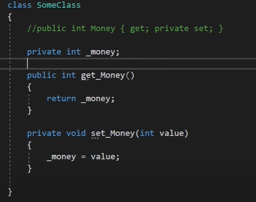

# **`Классы и объекты`**

Ссылочный тип данных.

Определяется:
- вне namespace
- внутри namespace
- внутри другого класса

## **Конструкторы**

- выполняют инициализацию объекта
- конструктор вызывается при создании объекта

Виды конструкторов:
- конструктор без параметров (по умолчанию)
- конструктор с параметрами

## **Ключевое слово this**

- указывает на текущий экземпляр класса
- решает проблему дублирования конструкторов

## **Иницализатор**

- выполняет инициализацию объекта

Моменты использования инициализатора:
- только для public полей
- вызывается после вызова конструктора

# **`Структуры`**

Значимый тип данных

## **Конструкторы структуры**

Структура может определять конструкторы, но **в отличие от класса** не обязательно вызывать конструктор для создания объекта. 

В таком случае, при получении данных их необходимо сначала проинициализировать. В противном случае будет ошибка.

Если определяем конструктор с параметрами, то он должен инициализировать все поля структуры.

**В отличие от класса**, нельзя инициализировать поля структуры напрямую при их объявлении.

# **`Типы значений и ссылочные типы`**

Параметры и переменные метода, которые представляют значимый тип, размещают свое значение в стеке.

Стек - структура данных, которая растет снизу вверх. Время жизни таких данных ограничего их контекстом

Когда программа запускается на выполнение, в конце блока памяти, зарезервированного под стек устанавливается указатель стека. При помещении данных в стек, указатель переустанавливается таким образом, чтобы он указывал на новое свободное место. При вызове каждого отдельного метода, в стеке будет выделяться объем памяти, для хранения значений переменных и параметров метода.

Ссылочные типы хранятся в куче, которую можно представить как неупорядоченный набор объектов. Физически, это остальная часть памяти, которая доступна процессу.

При создании ссылочного типа, в стеке хранится ссылка на адрес (значение) в куче. И, собственно, когда объект ссылочного типа перестает использоваться, в дело вступает сборщик мусора. Он видит, что в куче на объект нет больше ссылок, и условно удалает этот объект.

# **`Пространства имен, псевдонимы и статический импорт`**

## **Пространства имен**

- Классы, структуры заключаются в специальные контейнеры - namespace
- C визуальной точки зрения, это приставка для определяемых типов.

## **Псевдонимы** 

- Альтернативное имя уже существующему типу.

## **Статический импорт**

- импорт функциональности классов
- после такого импорта мы можем не указывать название класса при вызове методов, свойств.

# **`Модификаторы доступа`**

- public
- private
- protected
- internal
- private protected
- protected internal

# **`Свойства`**

- Специальные методы доступа
- Позволяют вложить дополнительную логику

- get и set, необязательно должны присутствовать вместе

## **Модификаторы доступа блоков**

Ограничения: 
- при установке модификатор, должны присутствовать два блока
- только один блок может иметь модификатор
- модификатор блока более ограничивающий, тем модификатор свойства

## **Автоматические свойства**

- Сокращенный вид свойства
- В ходе кодинга мы можем развернуть автосвойство и вложить в него дополнительную логику

# **`Перегрузка методов`**

Создание одного и того же метода, но с разным набором параметров.

Сигнатура:
- имя метода (при перегрузке остается неизменным только эта части сигнатуры)
- кол-во параметров 
- типы параметров
- порядок параметров
- модификаторы параметров

# **`Статические члены и модификатор static `**

Статические члены относятся ко всему классу и для обращения надо использовать имя класса/структуры.

На уровне памяти, для статических членов будет создаваться участок в памяти, который будет общим для всех объектов класса. Память для статических членов создается даже в том случае, если не создано ни одного объекта класса.

## **Статические методы**

Статичесие методы могут обращаться только к статическим членам класса.

## **Статический конструктор**

Отличительные черты:
- не имеет модификатор доступа и параметров
- нельзя внутри него использовать this
- выполняется автоматически один раз, при первом создании объекта класса или при первов обращении к его статическим членам

Используются для инициализации статических данных, либо для действий, которые необходимо выполнить только один раз.

## **Статические классы**

- создавать объекты такого класса нельзя
- могут содержать только статические члены
- не может быть базовым для кого-то
- не может быть наследником
- не может иметь перегруженных операций

Использование:
- для создание методов расширения
- если класс содержит набор логически как-то связаных друг с другом (например класс Math)

# **`Константы, поля и структуры для чтения`**

## **Константы** 

- должны быть проинициализирована при определении
- после определения значение не может быть изменено
- неявно статическое поле (обращение через имя класса)

## **Поля для чтения**

- инициализация (при определении или конструктор)
- можно использовать модификатор static (const - нет)

## **Структуры для чтения**

- readonly struct User { }
- все поля должны быть readonly

# **`Перегрузка операторов`**

Арифметические, логические операции могут использоваться для примитивных типов. Но для комплексных типов, компилятор не знает как применять данные операции. И для этого нам надо выполнить перегрузку операторов.

# **`Значение null`**

Одно из отличий значимых типов от ссылочных это то, что ссылочные типы могут принимать значение null.

## **Оператор ?? (объединения)**

- установка значения по умолчанию для типов, которые допускают значение null
- возвращает левый операнд, если операнд не равен null (иначе правый)
 
# **`Индексаторы`**

- позволяют проиндексировать объекты и обращаться к объектам по индексу.
- по форме напоминают свойства (только не имеет название, вместо него ключевое слово this, после него в квадратных скобках параметры)

# **`Наследование`** 

Создание нового функционала на основе старого.

- все наследуется от Object

Ограничения неследования:
- не поддерживается множественное наследование
- производный класс должен иметь модификатор доступа как базовый или более ограничивающий (если классы в разных сборках, то базовый должен иметь модификатор доступа public)
- класс с модификатором sealed наследовать нельзя
- нельзя наследовать от static класса

## **Доступ к членам базового класса из класса-наследника**

Доступ к членам базового класса возможен, если они имеют соответствующие для этого модификаторы доступа (все, кроме private)

## **Ключевое слово base**

- для обращение к базовому классу

## **Конструкторы в производных классах**

- при наследовании конструкторы не передаются производному классу

## **Порядок вызова конструкторов**

- сначала отрабатывают конструкторы базовых классов

# **`Преобразование типов`**

## **Восходящие преобразования. Upcasting**

Преобразование производного класса к базовому.

## **Нисходящие преобразования. Downcasting**

Преобразование базового класса к производному.

Нисходящее преобразование невозможно без предварительного восходящего преобразования.

## **Способы преобразований**

- as - пытается сделать преобразование, в случае неудачи результат будет null
- is - проверяет является ли какая-то переменная объектом какого-то типа (true/false)

# **`Перегрузка операций преобразования типов`**

- явное (explicit) - преобразование от примитвного типа к комплексному
- неявное (implicit) - наоборот

# **`Виртуальные методы и свойства`**

- Переопределение сторого функционала
- Добавление нового функционала

Для переопределения свойств/методов используются ключевые слова virtual/override.

- virtual - помечаем свойство/метод, что оно может быть переопределено (не обязательно)

При переопределении есть ряд ограничений:
- virtual/override свойства/методы должны иметь один и тот же модификатор
- virtual/override нельзя объявить со static

## **Запрет переопределения методов**

- с помощью ключевого слово sealed
- идет в паре с override

# **`Сокрытие`**

Другой способ изменить функциональность базового класса.

- для сокрытия используется ключевое слово new

Применение:
- когда в базовом классе есть метод, но он не virtual, а изменить функционал надо в производном
- к методоам, свойствам, переменным и константам

# **`Различие переопределения и сокрытия методов`**

Если на уровне памяти, то для работы с виртуальными методами, компилятор формирует таблицу виртуальных методов

Собственное понимание:
- сокрытие в пользу ссылок
- переопределение в пользу объектов

# **`Абстрактные классы и члены классов`**

- определяется с ключевым словом abstract
- определяет все, что и обычный класс (плюс абстрактные методы, свойства, индексатор, события)
- создать объект абстрактного класса НЕЛЬЗЯ
- абстрактные члены класса НЕ ДОЛЖНЫ быть private (производный класс должен переопределить и реализовать абстрактные члены класса)

## **Отказ от реализации абстрактных членов**

Мы можем отказаться от реализации, но в этом случае производный класс также должен быть определен как абстрактный

# **`Класс System.Object и его методы`**

- ToString()
- GetHashCode()
- GetType()
- Equals()
- MemberwiseClone()
- Finalize()

# **`Обобщения`** 

- параметризированный тип
- это шаблон с плейсхолдерами

Решает проблемы:
- упаковка/распоковка
- проблема безопасности типов (исключение InvalidCastException)

## **Значения по умолчанию**

- переменные универсального типа могут иметь значение по умолчанию с помощью оператора default(T) (ccылочный тип - null, значимый - 0).

## **Статические поля обобщенных классов**
## **Использование нескольких универсальных параметров**

# **`Ограничения обобщений`**

Типы ограничений:
- класс, интерфейс
- class - должен представлять ссылочные типы
- struct - должен представлять структуры или значимые типы
- new() - универсальный параметр должен представлять тип, который имееть конструктор без параметров

Можно устанавливать для универсального типа несколько ограничений, то они должны идти в определенном порядке:
- класс, class, struct - можно определить одно из этих значений
- интерфейс
- new()

# **`Наследование обобщенных типов`**
