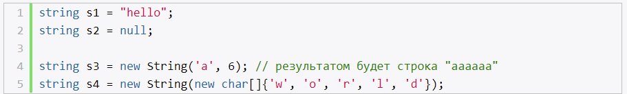
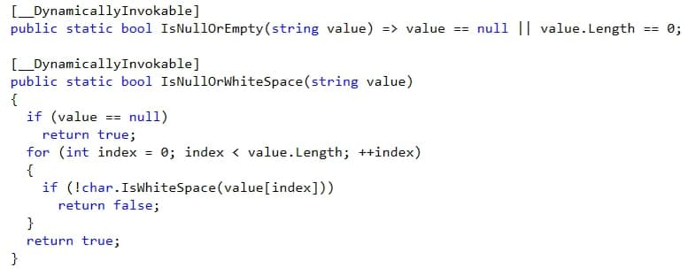

# **`Строки и класс System.String`**

- Unicode

## **Создание строк**

## **Строка как набор символов**

- для доступа к символам используется индексатор, как и в коллекциях

## **Методы класса String**

- concat
- compare
- join (объединяет строки с разделителем)
- format
- isNullOrEmpty
- isNullOrWhiteSpace

# **`Класс StringBuilder`**

- string - неизменяемая строка
- stringBuilder - динамическая строка

Описание StringBuilder:
- при создании, выделяется для строки больше памяти
- capacity - свойство (емкость, выделенная под объект)
- append, insert, remove, replace, appendFormat

Когда использовать String:
- малое кол-во операций
- фиксированное кол-во операций объединения, в этом случае компилятор может несколько операций объединить в одну
- когда надо сделать поиск в строке

Когда использовать StringBuider:
- неизвестное кол-во операций над строками
- множество подобных операций