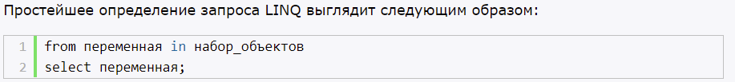
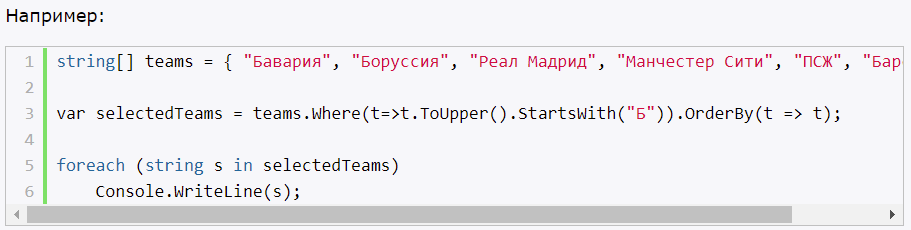
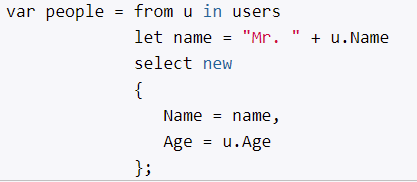
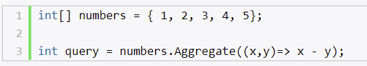
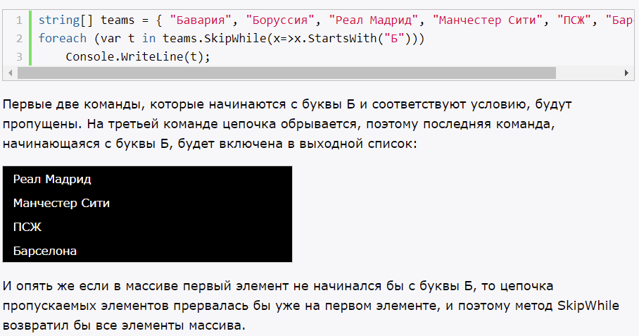
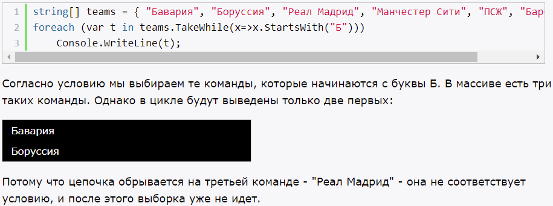
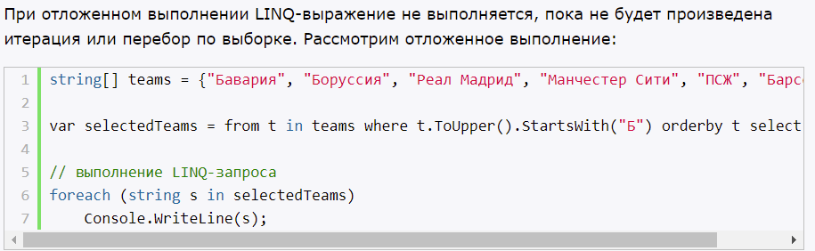
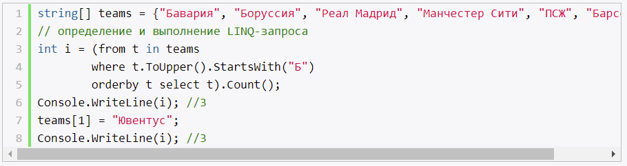
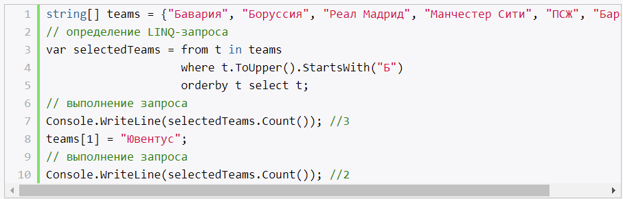

# **`Основы LINQ`**

- язык запросов к данным
- namespace - System.LINQ

Разновидности LINQ:
- LINQ to Objects - коллекции, массивы
- LINQ to Entities - EntityFramework
- LINQ to Sql - MS SQL Server
- LINQ to XML - XML
- LINQ to DataSet - объект DataSet
- PLINQ - для выполнения параллельных запросов

Преимущество:
- интуитивно похожы с запросами SQL

## **Методы расширения LINQ**

- цепочка методов к данным

- можно комбинировать стандартный синтаксис LINQ и методы расширения

# **`Фильтрация выборки и проекция`**

- where 
- selectMany
- select - проекция

## **Переменые в запросах и оператор let**

- одно из главных преимуществ операторов LINQ по сравнению с методами расширения

# **`Сортировка`**

- orderByAsceding
- orderByDesceding

# **`Объединение, пересечение и разность коллекций`**

- Except можно получить разность двух последовательностей
- Для получения пересечения последовательностей, то есть общих для обоих наборов элементов, применяется метод Intersect
- Для объединения двух последовательностей используется метод Union
- Если же нам нужно простое объединение двух наборов, то мы можем использовать метод Concat (как в SQL - UNION ALL)
- Для удаления дублей в наборе используется метод Distinct

Примечание:
- Последовательное применение методов Concat и Distinct будет подобно действию метода Union.

# **`Агрегатные операции`**

- count
- sum
- min
- max
- average

## **Метод Aggregate**

Метод Aggregate выполняет общую агрегацию элементов коллекции в зависимости от указанного выражения.

# **`Методы Skip и Take`**

- skip - пропускает определенное кол-во элементов
- take - извлекает определенное кол-во элементов
- skipWhile - пропускает цепочку элементов, начиная с первого элемента, пока они удовлетворяют определенному условию

- takeWhile - выбирает цепочку элементов, начиная с первого элемента, пока они удовлетворяют определенному условию

# **`Группировка`**

# **`Соединение коллекций. Метод Join, GroupJoin и Zip`**

- join -  для объединения двух разнотипных наборов в один
- GroupJoin - соединение плюс группировка
- zip - озволяет объединять две последовательности таким образом, что первый элемент из первой последовательности объединяется с первым элементом из второй последовательности, второй элемент из первой последовательности соединяется со вторым элементом из второй последовательности и так далее

# **`Методы All и Any, Contains`**

- определяют, соответствует ли коллекция определенному условию (true, false)
- all - соответствуют ли все элементы условию
- any - хотя бы одному
- contains - также как и any, только принимает параметры типа (int, string). Тогда как any (делегат)

# **`Отложенное и немедленное выполнение LINQ`**

## **Немедленное выполнение запроса**

С помощью ряда методов мы можем применить немедленное выполнение запроса. Это методы, которые возвращают одно атомарное значение или один элемент. Например, Count(), Average(), First() / FirstOrDefault(), Min(), Max() и т.д.

Также для немедленного выполнения LINQ-запроса и кэширования его результатов мы можем применять методы преобразования ToArray<T>(), ToList<T>(), ToDictionary() и т.д..